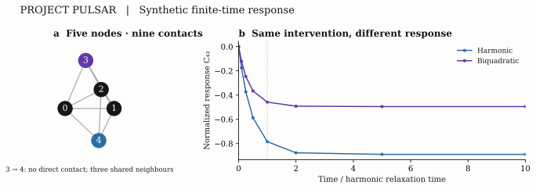
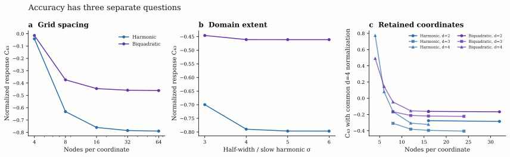

# Allosteric response benchmark

**A Pulsar research fixture for finite-time thermal response in an elastic contact network.**

This repository asks a small, precise question: can two models with identical local stiffness predict different changes in fluctuating contact energy after the same local intervention? It provides a five-node fixture, a harmonic reference, a biquadratic contact model, numerical response calculations and independent checks.

The calculations concern a dimensionless synthetic system. They do not predict protein allosteric sites, validate biological rankings, execute quantum hardware or demonstrate a computational speedup.



## What the experiment does

Imagine five points connected by elastic contacts. At thermal equilibrium, the points fluctuate around their reference geometry. We slightly strengthen the contacts around one point and calculate how the expected contact energy around another point changes after a specified interval.

We compare two descriptions of the unperturbed motion. The harmonic model retains the quadratic expansion around the reference geometry. The biquadratic model also retains the higher-order geometric terms of a specified contact-energy law. Both use the same graph, retained displacement coordinates, intervention function, receiver observable, observation horizon and reference normalization.

The reference calculations show that matching local curvature does not determine this finite-time response. The effect is a reduction in the magnitude of an already nonzero harmonic response. No physical ground-truth measurement establishes which model is more accurate.

## Run the calculation

Use **Python 3.12**. Create a clean environment and install the pinned dependencies:

```bash
git clone https://github.com/orbion-life/allosteric-response-benchmark.git
cd allosteric-response-benchmark
python -m venv .venv
source .venv/bin/activate
python -m pip install -r requirements.txt
python reproduce.py
pytest
```

The activation command above is for a Unix-like shell. Use the corresponding activation command for your environment. `python reproduce.py` is the reproduction entry point; `pytest` runs the numerical consistency tests. The dependency file and execution records identify the environment used for a particular run. No structure download, account, API key, molecular trajectory or quantum processor is needed for the calculations.

The complete sensitivity study includes grids with up to 65,536 configurations. Runtime and memory use depend on the numerical libraries and machine. A configuration is one point in displacement-coordinate space, not a node, residue or experimental replicate.

## The fixture

The reference coordinates are:

| Node index | x | y | z |
|---:|---:|---:|---:|
| 0 | 0.00 | 0.00 | 0.00 |
| 1 | 1.10 | 0.00 | 0.00 |
| 2 | 0.45 | 0.95 | 0.00 |
| 3 | 0.35 | 0.30 | 0.95 |
| 4 | 0.65 | 0.28 | −0.85 |

Every pair is connected except nodes 3 and 4. There are nine contacts; node degrees are `(4, 4, 4, 3, 3)`. The displayed response uses node 3 as the sender and node 4 as the receiver. These are zero-based synthetic node indices, with no biological functional annotation.

Five nodes in three-dimensional space have 15 Cartesian displacement coordinates. The reference Hessian has six rigid-body zero modes, corresponding to three translations and three rotations, leaving **nine internal harmonic modes**. The initial experiment retains the two lowest positive modes. Follow-up calculations retain three or four. These are coordinates describing collective motion of the same five nodes; adding a retained coordinate does not add a node.

For an orthonormal retained basis $B$, the configuration is

$$
r=r_0+Bq.
$$

Omitted coordinates are held at their reference values. They are not thermally integrated out. Increasing the number of grid nodes at fixed retained dimension does not recover those omitted motions.

## Energy, intervention and response

For each included contact, let $\ell_{ij}=\lVert r_{0,i}-r_{0,j}\rVert$. The biquadratic model is

$$
U_A(r)=\sum_{(i,j)}u_{ij}(r),\qquad
u_{ij}(r)=\frac{\kappa}{8\ell_{ij}^{2}}
\left(\lVert r_i-r_j\rVert^{2}-\ell_{ij}^{2}\right)^{2}.
$$

Its quadratic expansion at $r_0$ defines the matched harmonic model. In the retained eigenvector basis,

$$
U_H(q)=\frac12\sum_{a=1}^{d}\lambda_a q_a^2.
$$

The Hessians agree at the reference geometry. This equality constrains local curvature, not the higher-order energy landscape or finite-temperature response.

The node observable averages its incident contact energies:

$$
E_i(r)=\frac{1}{d_i}\sum_{j\in\mathcal N_i}u_{ij}(r).
$$

We add a small, dimensionless field $h\geq0$ to the sender, so the perturbed energy is $U+hE_i$. This increases the coefficients of the sender's incident contacts. **The same full contact-energy function $E_i$ is used in both models**, including when the unperturbed dynamics are harmonic. Changing the observable along with the model would answer a different question.

Each model starts from its own unperturbed equilibrium distribution $\pi\propto e^{-\beta U}$. The field is switched on at time zero and remains on. The response is

$$
R_{ji}(t)=\left.\frac{\partial}{\partial h}
\mathbb E_h[E_j(t)]\right|_{h=0^+}
=-\beta\left\{
\operatorname{Cov}_\pi(E_i,E_j)
-\operatorname{Cov}_\pi(E_i(0),E_j(t))
\right\}.
$$

This identity applies to the reversible dynamics used here. The derivative changes the dynamics while holding the initial unperturbed distribution fixed. It is not the derivative of an already re-equilibrated perturbed distribution unless the long-time limit is taken.

The implementation uses a uniform, reflecting grid with nearest-neighbour rates

$$
q_{xy}=\frac{2D}{\delta^2[1+e^{\beta(U_y-U_x)}]},
\qquad D=\frac{\mu}{\beta}.
$$

The backward generator acts on observable columns as $Lf(x)=\sum_y q_{xy}[f(y)-f(x)]$. Probability rows evolve as $p(t)=p(0)e^{tL}$. Opposite rates satisfy detailed balance. Removing outward grid edges implements the reflecting boundary.

With $\Pi=\operatorname{diag}(\pi)$ and $e_i=\Pi^{1/2}(E_i-\mathbb E_\pi E_i)$,

$$
H=-\Pi^{1/2}L\Pi^{-1/2},\qquad
R_{ji}(t)=-\beta e_i^T(I-e^{-tH})e_j.
$$

This representation supports independent checks: $H$ is symmetric and positive semidefinite, $H\sqrt\pi=0$, $R(0)=0$, and $R$ is symmetric and negative semidefinite up to numerical error. Individual off-diagonal entries can have either sign. A negative entry is not evidence of biological inhibition, and this reciprocal response does not demonstrate directed biological information flow.

## Units, normalization and time

The coordinates, energies and parameters are expressed in the fixture's dimensionless units. In particular, **$\kappa$ is a dimensionless contact-stiffness coefficient**, not a measured protein spring constant or a value in newtons per metre. If physical reference scales $L_0$ and $E_0$ were supplied, the corresponding dimensionless coefficient would be $k_{\mathrm{physical}}L_0^2/E_0$; no such physical calibration is claimed here.

The initial experiment uses $\kappa=10$, inverse temperature $\beta=1$ and mobility $\mu=1$. The stiffness sweep uses $\kappa\in\{10,30,100,300,1000\}$ at fixed $\beta=1$. Larger $\kappa$ reduces the scale of thermal displacements in this fixture. It also changes the reference relaxation time, so comparisons use a common value of $t/\tau$, not a common physical duration.

The default observation horizon is the slowest retained harmonic relaxation time,

$$
\tau=\frac{1}{\mu\lambda_1},\qquad t=\tau.
$$

This is a model timescale. It is not an experimentally measured physiological timescale.

For each model comparison, the normalized response is

$$
C_{ji}=\frac{R_{ji}}{\beta s_i^H s_j^H},\qquad
(s_i^H)^2=\operatorname{Var}_{\pi_H}(E_i).
$$

The reference standard deviations are calculated from exact Gaussian moments of the same quartic observables under the unbounded, retained-coordinate harmonic distribution. They are shared by the harmonic and biquadratic models at the same stiffness, temperature and retained dimension. The finite-grid dynamics still have a bounded domain. $C$ is dimensionless but is not a correlation coefficient and is not generally bounded by one.

Changing retained dimension also changes these reference standard deviations. Dimension comparisons therefore include raw $R$ and an additional normalization shared across the two-, three- and four-coordinate models. The output field `C_common_d4` uses the same four-coordinate harmonic standard deviations throughout that comparison.

## Recorded reference calculations

The following values describe the existing reference calculations. Reproduction should be judged with the recorded numerical tolerances, not by byte-for-byte equality of floating-point values or timings.

At $d=2$, $\beta=\mu=1$, $t=\tau$, 32 grid nodes per coordinate and domain $q_a\in[-4/\sqrt{\beta\lambda_1},4/\sqrt{\beta\lambda_1}]$, the receiver-4/sender-3 normalized responses were:

| $\kappa$ | Harmonic $C_{43}$ | Biquadratic $C_{43}$ |
|---:|---:|---:|
| 10 | −0.799991 | −0.050159 |
| 30 | −0.791742 | −0.195190 |
| 100 | −0.785145 | −0.458332 |
| 300 | −0.782998 | −0.642471 |
| 1000 | −0.782435 | −0.735550 |

The difference decreases as stiffness increases over these tested settings. This is consistent with a smaller effect of higher-order terms at smaller thermal displacements. It is not evidence that one law is a more accurate physical model.

The initial $\kappa=10$ calculation exposed a substantial strain limitation: at the 32-node grid, the biquadratic equilibrium assigned about 23.1% probability to configurations with at least one contact changing length by more than 20%. The subsequent stiffness, temperature, domain and dimension studies are **exploratory follow-up checks**, added after the initial result was inspected. All tested settings are retained; they are not independent replicates or a preregistered performance study.

At $\kappa=100$ on that same grid, the biquadratic probability of a contact-length change above 20% was about $2.73\times10^{-5}$, and the mean maximum absolute contact strain was about 5.29%. These diagnostics make the numerical regime inspectable. They are not biological validity thresholds or a general guarantee of physically realistic motion.



The grid study also exposes a computational limitation. At $\kappa=100$, the biquadratic $C_{43}$ changed from approximately −0.373844 with eight nodes per coordinate to −0.458332 with 32 and −0.461050 with 64. Small configuration registers alone therefore do not establish that a sufficiently accurate discretization will fit a quantum device.

The fixed-spacing domain study separately expands the boundary. Tests with two, three and four retained coordinates separately probe reduction sensitivity. Neither study establishes convergence to all nine internal coordinates or to an unbounded continuous model.

## How the calculation is checked

The reference workflow contains complementary checks with different roles:

| Check | What it establishes |
|---|---|
| Hessian, rigid-mode and basis checks | The retained coordinates are constructed from the declared reference network. |
| Detailed balance, stationarity and generator conservation | The discrete dynamics preserve the intended finite-grid equilibrium. |
| Forward finite-field differences | The covariance expression agrees with a directly perturbed calculation as the field shrinks. |
| Independent dense Fréchet derivative | A separately implemented derivative of the matrix exponential agrees with the covariance response on small grids. |
| Gaussian quadrature and scalar moments | Independent calculations agree on the harmonic reference normalization. |
| Polynomial reconstruction | Shared coordinate observables reproduce the full five-by-five response matrix. |
| Grid, boundary, stiffness, temperature and retained-dimension studies | The result's dependence on numerical and physical-model choices is visible. |
| Chebyshev and explicit walk-matrix checks | The proposed operator identities reproduce the same discrete propagator within numerical tolerances. |

The independent response implementation evaluates the contact energies and backward generator directly, uses a separate scaling-and-squaring exponential calculation, differentiates with the matrix-exponential Fréchet derivative, and checks normalization by Gauss–Hermite quadrature. Across six small-grid cases at $\kappa=10,100,1000$, its maximum normalized discrepancy between the derivative and covariance responses was approximately $1.08\times10^{-15}$. It reuses the declared geometry and retained basis; it is an independent response implementation, not an independent physical model.

The replay checker compares 10,535 numeric fields against archived reference results using absolute and relative tolerances of 10⁻⁸. It excludes explicitly listed timing, software and resource metadata. A separate test requires the independent normalized derivative discrepancy to stay below 10⁻¹⁰. These replay tolerances do not estimate grid, domain, coordinate or biological error.

## Polynomial reconstruction and the quantum-walk connection

After the affine coordinate reduction, each $E_i$ is a polynomial containing monomials of total degrees two through four. Writing $E=A\phi(q)$ allows a shared matrix of delayed monomial correlations to reconstruct all node responses. At $d=2$, there are at most 12 such monomials; at $d=4$, at most 65. Dependencies can reduce the effective dimension further.

The reconstructed matrix has five rows and five columns because the fixture has five nodes. Its size does not demonstrate preservation of information from omitted physical coordinates. A five-node matrix also cannot test a top-five selection task: every node would be selected.

For the equal-spacing $d$-dimensional grid, choosing $\nu=4dD/\delta^2$ gives a stochastic matrix $P=I+L/\nu$ and a symmetric discriminant $M=I-H/\nu$. The code checks a row-preparation unitary, a swap, and a reflection whose projected walk powers reproduce the Chebyshev polynomials $T_k(M)$. Those polynomials approximate the dissipative propagator through

$$
e^{-tH}=\sum_{k=0}^{\infty}a_k T_k(M),\qquad
a_0=e^{-z}I_0(z),\quad
a_{k>0}=2e^{-z}I_k(z),\quad z=\nu t,
$$

where $I_k$ is the modified Bessel function. The nonnegative coefficients sum to one, so their omitted sum bounds polynomial truncation error.

These are **classical matrix and polynomial calculations**. The explicit unitary check is not a transpiled gate circuit, a noisy-device experiment or a complete quantum resource estimate. State preparation, coefficient selection, controlled walk operations, overlap measurements, classical preprocessing and reconstruction all contribute to any eventual implementation cost.

## Outputs and reproducibility

The reproduction entry point writes its generated records under `results/`. The principal output names are:

| Output | Contents |
|---|---|
| `results.json` | Initial fixture parameters, geometry, matrices, field checks and polynomial checks. |
| `sensitivity-results.json` | All declared follow-up settings, response matrices, diagnostics and operator checks. |
| `independent-response-check.json` | The independent small-grid derivative and normalization comparisons. |
| `execution.json`, `verification.json` | Source identities, execution method, warning records and runtime metadata. |
| `figure-data.csv`, `finite-field-data.csv` | Initial response and finite-field values in tabular form. |
| `sensitivity-figure-data.csv`, `time-curve-data.csv` | Follow-up values and responses at different observation times. |

The public source uses explicit contraction calls: dense operations use unoptimized `einsum`, and sparse operations retain sparse implementations. No runtime source transformation is needed. This evaluation route was cross-checked against the original matrix-multiplication calculation, and warnings cause the numerical subprocesses to fail. Numerical agreement through the alternative route does not establish the cause of warnings observed through another route. Source identities and the actual execution method belong in each run's records.

The scientific calculations are deterministic for the declared settings. Floating-point rounding, eigensolver conventions, timing and process-memory measurements can vary by platform. Compare mathematical outputs using tolerances and preserve the environment and source hashes. Runtime metadata is not a biological result or a quantum resource benchmark.

## Choosing resolution and compression

The complete [selection protocol](docs/resolution-and-compression.md) explains the proposed decision process and its literature basis. It is a protocol for future work, not an assertion that this fixture has passed a compression-accuracy target.

1. At fixed coordinates and domain, refine spacing and assess the response on at least three grids; check extrapolation with a fourth.
2. Expand the domain at fixed spacing. Require repeated response stabilization and inspect boundary-weighted observables.
3. Resolve each coordinate model before comparing it with a named larger reference, using common normalization and times.
4. Choose the least costly tested representation satisfying the declared response tolerance and separating the selected score intervals. If no affordable representation passes, record that result.

The initial proposed absolute response budget is 0.002 for coordinate reduction against a resolved larger reference, 0.001 each for grid, domain and other deterministic effects, and 0.005 simultaneous measurement half-width. These are engineering allocations, not biologically validated thresholds. Empirical refinement estimates do not become rigorous bounds or establish 95% coverage for the total error. The current coordinate study remains unresolved.

## Reproduction record and repository map

A clean local Python 3.12 replay passed all 10,535 reference comparisons and five tests on 12 September 2026. The public workflow repeats the calculation on Linux and macOS; see [the actual CI runs](https://github.com/orbion-life/allosteric-response-benchmark/actions/workflows/reproduce.yml) for their status. Timings are machine-dependent. Generated logs, figures, verification and source-hash receipts are retained as CI artifacts.

- `experiment.py`: initial κ = 10 fixture and response checks.
- `sensitivity.py`: recorded follow-up sweeps, common-normalization dimension comparisons and walk identities.
- `independent_check.py`: separate scalar-energy, dense derivative and quadrature checks.
- `reproduce.py`: full reproduction, verification, figure generation and provenance.
- `reference/`: archived numerical results used for replay comparison.
- `figures/`: data-derived SVG and PNG figures; regenerate with `python make_figures.py`.
- `docs/experiment-history.md`: exploratory sequence and implementation history.
- `docs/resolution-and-compression.md`: proposed selection rules, evidence and limits.
- `tests/`: scientific consistency and regression checks.

To write a separate run, use `python reproduce.py --output results-repeat`. The default test suite reads `results/`; the reproduction command itself verifies every selected output directory. Reproduction is numerical within declared tolerances, not byte identity. Figure SVG metadata is stabilized, but font rendering can still differ across platforms.

## Primary references

The spring-law precedent comes from [Delingette (2008)](https://doi.org/10.1109/TVCG.2007.70431), a nonlinear membrane model; this is a cross-domain modelling precedent, not validation for proteins. [Al-Mohy and Higham (2011)](https://doi.org/10.1137/100788860) describe the exponential-action method used for sparse classical propagation. [Marteau (2023)](https://arxiv.org/abs/2306.14993) provides a qubitization/Chebyshev connection relevant to the operator construction. The reduction protocol additionally cites [Celik et al. (2008)](https://doi.org/10.1115/1.2960953), [Grepl and Patera (2005)](https://doi.org/10.1051/m2an:2005006) and [Lelièvre and Zhang (2019)](https://doi.org/10.1137/18M1186034), with applicability limits stated in the protocol.

## Scope and contributions

The useful outcome is an inspectable response calculation and a set of tests that expose its assumptions. Biological labels, protein structures, molecular-dynamics trajectories, atomistic force fields, parameter fitting, site-ranking benchmarks and hardware execution are outside this fixture.

Contributions that improve independent verification, numerical analysis, provenance or documented failure cases are welcome. Changes to the physical law, intervention, normalization or coordinate reduction should be identified as model changes and compared explicitly with the existing fixture. Retain unsuccessful parameter cases and avoid tuning against biological outcomes absent from this repository.

If you use the code, identify the repository and commit or release, report the settings you ran, and describe the results as synthetic calculations.

## License

MIT. See [LICENSE](LICENSE).
