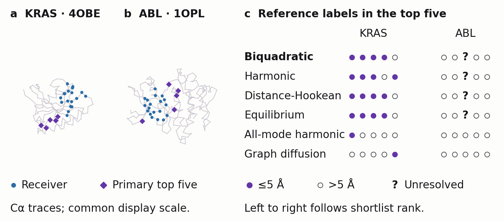
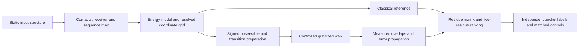

# Allosteric response benchmark

**Project Pulsar: reproducible static-structure mechanics and a complete quantum-walk estimator.**

This repository tests whether static contact mechanics identify regulatory pockets, whether numerical reductions preserve their responses, and whether quantum evaluation is useful at complete cost. Version **0.4.0** adds an observable-seeded response-operator experiment. Earlier protein predictions, failed coordinate remedies and quantum fixtures remain unchanged.

## What version 0.4.0 establishes

| Question | Recorded result | Scope |
|---|---|---|
| Can projection retain the original finite-model response? |17/18 cases pass calculated accuracy bounds;16 also pass the cold-cost gate. All 18 measured response errors are below 0.002. |Three synthetic geometries, three stiffnesses, two grids and three times; every internal coordinate is retained. |
| Are the physical references converged? |All 9 grid and all9 domain checks exceed0.001. |Finite-operator fidelity does not establish continuum or protein accuracy. |
| Is the calculation repeatable? |27 archives and 1,065 arrays agree within 1.17×10⁻¹⁵ in the full same-host replay. |Timings are separate measurements; both replay acceptance counts remain unchanged. |
| Does a direction register establish a quantum saving? |Nine-state walk algebra passes, but native compilation exceeds the million-operation cap. |Complete readout and matched circuit comparison are unfinished; no cost saving is established. |


- [Observable-preserving reduction, derivation, all cases and complete replay commands](experiments/observable-preserving-reduction/README.md).
- [Original-grid direction-register walk and bounded implementation status](experiments/direction-register-walk/README.md).
- [Proposed external-family and functional validation](docs/proposed-external-validation.md), with unresolved cohort, precision and control choices.
- [Version 0.4.0 release notes](RELEASE-NOTES-v0.4.0.md).

The Gaussian 27-response benchmark and external biological panel remain proposed. A compact response operator strengthens the classical comparator; it does not automatically create an efficient quantum workload. Source and protocol hashes, unsuccessful checkpoints, monitoring receipts and independent checks accompany the results.



## What version 0.3.0 establishes

| Question | Recorded result | Interpretation |
|---|---|---|
| Does the KRAS contact result transfer to ABL? | KRAS has four known contacts among five predictions. ABL has zero known contacts and one unresolved member, giving bounds of zero to one contact. | The fixed model does not demonstrate useful ABL transfer. Unknown positions are not counted as definite misses. |
| Does nonlinearity improve the declared controls? | No comparison passes the six-slot Holm correction. The smallest adjusted p is 0.075592 for ABL versus harmonic; its mean percentile gain is 0.017098. | A small retrospective rank shift is retained, without a demonstrated comparative benefit. |
| Do the two compression remedies pass? | A 64-coordinate receiver-strain basis gives KRAS harmonic error 0.198519. Additive harmonic completion fails the fixed nonlinear toy gates. | Neither tested remedy establishes faithful compression; finite-grid reference limits remain explicit. |
| What does the evaluated 1,089-state KRAS model cost? | Twelve observable directions use 78 overlaps. Sufficient ideal shot estimates range from 37.19 million to 121.88 million across exact readout bases. | These are retrospective, ranking-aware plans. Full transition loading and full quantum execution remain unresolved. |
| What Gaussian comparator was proposed in v0.3.0? | A fixed-centroid Gaussian covariance model has a strictly convex objective; its algebra and coordinate-domain check pass. | Nonlinear-response validation is proposed, not completed. It initially supplies a classical comparator and does not establish a useful quantum task. |

The corrected KRAS evaluator excludes missing reference residues 105–107 from its null pool while retaining their prediction ranks. It uses 123 evaluable candidates among 126 predictions. The amended three-slot contact-enrichment p is 0.00029997 for KRAS and 1 for ABL; the unrun MYH7 slot remains explicit. These conditional-label statistics do not establish functional allostery. Model scales are not physiologically calibrated.

## Preserved version 0.3.0 evidence and replay instructions

- [KRAS missing-reference correction](experiments/kras/evaluation-amendment/README.md), with every original score and ranking retained.
- [Locked ABL pilot](experiments/abl/pilot/README.md), including the complete 252 × 252 matrices, mappings, distances and all controls.
- [Joint statistical audit and portable figure sources](experiments/two-target-comparison/README.md).
- [Same-model quantum cost](experiments/kras/same-model-cost/README.md), including actual preparation compilations, loading stops and operational interval rules.
- [Nonlinear harmonic-completion experiment](experiments/harmonic-completion/README.md), including all 81 reference/result archives and an independent intervention check.
- [Receiver-sensitive coordinate experiment](experiments/receiver-sensitive-coordinates/README.md), with explicit tied-subspace handling.
- [Proposed Gaussian closure](experiments/gaussian-closure-design/README.md), with derivation, literature, fixed reference tests, compute limits and failure decisions.

Run the documented experiments in a fresh clone or separate output directory. Environments are pinned per package. The comparative automated workflow replays ABL, the evaluation amendment, sampling-cost analysis, receiver basis and fast algebra checks. The optional full-completion workflow repeats all 72 synthetic grid cases; the complete local replay is also retained. A passing software check means the stated calculation is reproducible, not that its scientific acceptance gates pass.

## The preserved version 0.2.0 evidence

| Question | Recorded result | Interpretation |
|---|---|---|
| Can the reduced KRAS model produce traceable predictions? | Residues 60, 69, 62, 61 and 65 are the primary top five; four contact the 6OIM MOV ligand within 5 Å. | A retrospective pocket-contact result on one cross-variant example. |
| Does the nonlinear or finite-time model improve this endpoint? | Matched harmonic, distance-Hookean and equilibrium controls also recover four of five. | No benefit is demonstrated by this endpoint. |
| Do two modes preserve the response? | The harmonic candidate-to-receiver block differs from the exact 492-mode harmonic reference by 0.2183, against the provisional 0.002 allowance. | The representation fails its approximation check. Grid convergence does not repair it. |
| Does the complete circuit implement its declared estimator? | Seven qubits, three overlaps and 151,887 ideal simulated shots give maximum same-grid normalized response error 1.64 × 10⁻⁷. | The circuit works on a separate one-mode, four-state fixture. Its shortlist differs from the two-mode pilot. |
| Is the quantum calculation practically advantageous? | Each overlap uses 2,304 CX gates before routing; conservative noisy-ranking intervals do not separate. The same-grid classical solve takes a local median 0.171 ms. | No hardware feasibility, robust noisy ranking or computational speedup is established. |

Every response uses the named normalization. Protein energy and time units are not physiologically calibrated. No classical molecular-dynamics trajectory, quantum hardware, account or API key is required for these calculations. Missing negative-pocket evidence, construct differences and failed compression remain explicit.

## Explore the evidence

- [Controlled KRAS pilot, all comparisons and replay instructions](experiments/kras/pilot/README.md).
- [Interactive KRAS structure viewer](experiments/kras/pilot/figures/kras-structure-viewer.html): download and open locally to rotate the input model and inspect the selected residues.
- [Complete circuit, architecture, precision derivation and measured costs](experiments/kras/quantum/README.md).
- [Complete protein preparation and execution timing](experiments/kras/pilot/cost/pilot-cost-replay.md).
- [Four-target validation protocol, exact mappings and finite-null evaluation](experiments/kras/protocol/README.md).
- [Independent harmonic-coordinate check](experiments/harmonic-coordinate-check/README.md).
- [Original synthetic benchmark and its complete mathematical description](SYNTHETIC_BENCHMARK.md).
- [Version 0.1.0](https://github.com/orbion-life/allosteric-response-benchmark/tree/v0.1.0) preserves the earlier synthetic-only release.

## How the calculation works

A protein is represented by its resolved alpha-carbon coordinates and elastic contacts. Each residue's observable is the mean biquadratic energy of its incident contacts. A small sustained perturbation increases that local energy coefficient. The response is the change in **mean contact energy** at a defined functional receiver, evaluated from equilibrium and delayed covariances.

$$
R_{ji}(t)=-\beta\left[\operatorname{Cov}_{\pi}(E_i,E_j)-\operatorname{Cov}_{\pi}(E_i(0),E_j(t))\right],\qquad
C_{ji}=\frac{R_{ji}}{\beta s_i^{\mathrm H}s_j^{\mathrm H}}.
$$

The ranking is the root mean square of C over the fixed receiver set. It is a mechanical sensitivity, not a probability of allostery, binding affinity or inhibition. Model comparisons retain the same observable. The quantum and exact discrete classical solvers use the same grid, transition rates and reconstruction.



The physical compression and quantum readout reductions are different operations. Holding 491 protein modes fixed changes the physical model. Reducing linearly dependent observable vectors on one fixed grid changes its calculation without restoring any omitted motion. Both classical and quantum solvers can use the latter reduction.

## Reproduce each experiment

The pilot and circuit use Python 3.12 with separate virtual environments for their pinned dependency sets. The structural-validation protocol records its separately verified Python 3.9 environment. Clone this repository, enter the experiment directory and follow its README. Cached scientific inputs make the calculations network-independent after dependencies are installed.

**KRAS pilot**

```sh
cd experiments/kras/pilot
python3.12 -m venv .venv
.venv/bin/python -m pip install -r requirements.txt
.venv/bin/python prepare.py
.venv/bin/python -W error run_pilot.py
.venv/bin/python -W error evaluate.py
.venv/bin/python -W error verify.py
.venv/bin/python plot_pilot.py
```

The command above reproduces the historical evaluator. For current interpretation, then run the [unknown-aware evaluation amendment](experiments/kras/evaluation-amendment/README.md). Run in a copy when preserving the original timestamped receipts matters. The full numerical run produces 24 grid cases, eight analytic harmonic references and a structural-baseline archive. Fresh same-host replays reproduced every array across all 33 archives identically. Cross-machine verification uses declared numerical tolerances; wall time and memory are not fixed outputs.

**Complete quantum circuit**

```sh
cd experiments/kras/quantum
python3.12 -m venv .venv
.venv/bin/python -m pip install -r requirements-lock.txt
.venv/bin/python run.py --output results-reproduced
.venv/bin/python verify.py --results results-reproduced
```

This runs the actual synthesized circuits through Qiskit Aer. Statevector and density-matrix evolution, finite-shot measurements, norm restoration, routing and synthetic noise are recorded. The package includes saved logical and synthesized QPY/OpenQASM circuits. A simulator can sample repeatedly from one evolved state, so gate-count-times-shot totals are projected device work, not hundreds of millions of independently simulated gates.

**Synthetic benchmark**

The original root-level `reproduce.py` and tests remain unchanged. Install the root `requirements.txt`, run `python reproduce.py`, then `python -m pytest -q`. Its settings and normalization differ from the KRAS pilot; do not combine their numerical values as if they were one experiment.

## Inputs, controls and repeatability

The original KRAS input is [RCSB 4OBE](https://www.rcsb.org/structure/4OBE), chain A, KRAS4B residues 1–166. Eighteen input GDP-contacting residues define the receiver; GDP is then excluded from the mechanical model. The evaluation uses mapped [6OIM MOV contacts](https://www.rcsb.org/structure/6OIM). The input and reference differ at G12C, C51S, C80L and C118S. The protocol and prediction freeze precede numerical pocket evaluation, but the known structures make the study retrospective rather than prospectively blinded.

The full matrix, every candidate rank, five distances, common normalizers, raw sources, random seeds, dependency locks, numerical checks and failure records accompany each experiment. Equilibrium covariance, analytic all-mode harmonic response, matched energy laws, graph diffusion, degree, receiver distance and pinned upstream Ohm are retained as controls. Ohm is the current upstream implementation, with documented differences from the 2020 paper; it is not presented as an exact paper reproduction.

The optional Ohm replay rebuilds the archived upstream source with GCC 15+ and its preserved compatibility patch. The primary seed, repeat and alternative seeds/alpha settings remain visible. No unannotated pocket is relabelled a biological negative. No result establishes transfer to other proteins.

## Licensing and citation

The original Project Pulsar code is MIT-licensed. The separately archived Ohm source and its compatibility patch are GPL-3.0, with bundled notices retained. PDB coordinates, UniProt sequences and PDBe mappings retain their data-source licenses and attribution. See [LICENSES.md](LICENSES.md) for their exact scope and source links; the root MIT license does not replace third-party terms.

Use [CITATION.cff](CITATION.cff) to cite this versioned software, and cite the original structural and algorithmic papers when reusing their data or methods. This release contains research calculations and their limits; it is not a validated drug-discovery product.

The optional `compare_runs.py` performs a strict same-host repeatability check: compare two newly generated runs on your own machine. Do not use exact equality against the archived Mac run as a cross-platform acceptance test; the independent algebra and circuit checks in `verify.py` use explicit numerical tolerances.
