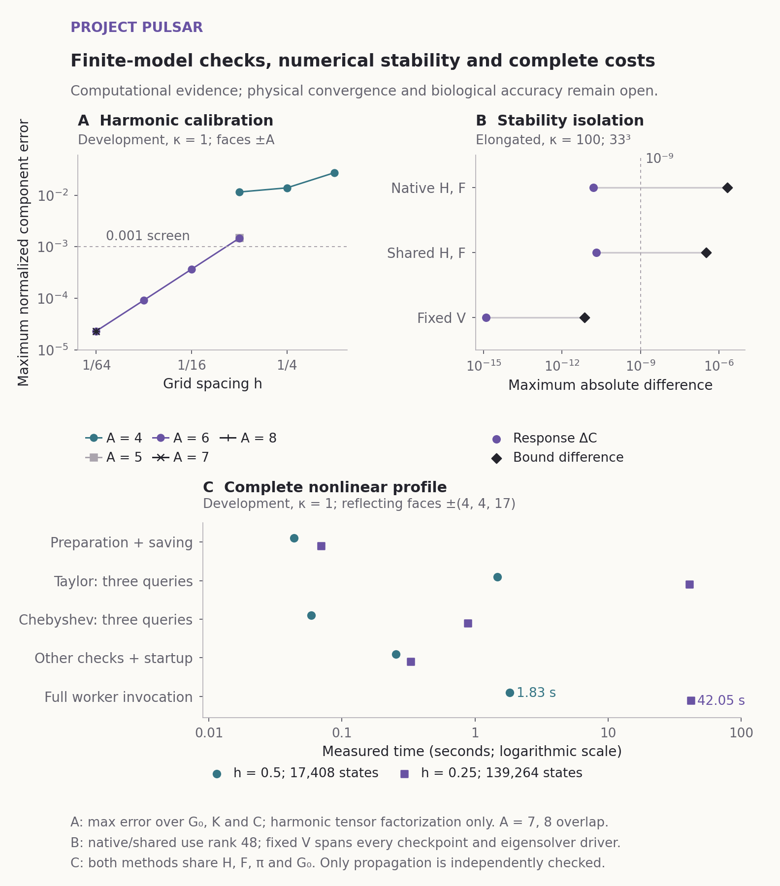

# Version 0.5.0 measures the first milestone's resource needs

Prepared 13 September 2026. This release adds new experiments and planning evidence. It does not change any earlier scientific result, tolerance or failed verification.

## Completed evidence

- The harmonic reference now has independent Gaussian-moment and Hermite calculations, plus a 216-state finite-grid parity check. Exact tensor factorization retains the quartic observables while avoiding a full Cartesian grid. The complete calibration took 0.72 seconds and 136 MB sampled aggregate memory on the recorded host. The final normalized continuum error was below 2.30 × 10⁻⁵. Final harmonic grid and domain comparisons pass separately.
- Two complete nonlinear cost probes took 43.9 seconds and 206 MB sampled aggregate memory. Taylor and Chebyshev propagation agree within 1.87 × 10⁻¹¹ for the same operator and observables. They share equilibrium and static covariance. The spacing comparison changes normalized static covariance by 0.000278, delayed covariance by 0.00414 and response by 0.00429. The last two fail the unchanged 0.001 screen. There is no nonlinear domain-convergence result from these probes.
- Additional congruent minima require larger development-domain faces, (6,5,17), under the already declared two-unit margin. The corrected five-grid schedule contains 32,640, 261,120, 2,088,960, 3,096,576 and 4,358,144 states. This corrects the infeasible v11 allocation and then broadens it to include the newly identified minima. Finding these minima does not prove complete domain coverage or define a native basin.
- A separate construction-only check built the largest corrected grid and touched forty additional state vectors. It took 5.37 seconds and 3.39 GB sampled aggregate memory. It did not calculate an exponential or response. Measured actions and smaller complete propagations support an estimated 8.88-hour five-grid workload, including both propagators, preprocessing, verification and a declared twofold planning margin. A future nine-hour, 6-GB, one-worker allocation remains an estimate with hard stop rules, not measured campaign performance or guaranteed convergence.
- Two same-host numerical environments produced six complete subspace traces. In the elongated stress case at rank 48, identical H and F still produce a 3.21 × 10⁻⁷ bound discrepancy and a 2.09 × 10⁻¹¹ response discrepancy. Holding the basis V fixed reduces the largest bound difference across tested eigensolvers to 7.14 × 10⁻¹². This implicates amplification in basis construction. It does not establish a unique defective operation, a validated remedy or the cause of every historical Linux failure.

## Public evidence and replay

The new packages are [physical-reference-recovery](experiments/physical-reference-recovery/README.md) and [subspace-stability-diagnostic](experiments/subspace-stability-diagnostic/README.md). The stability package supplies source and compact findings in Git; separately hashed release assets retain complete raw traces, incomplete attempts and corrections. Public replay instructions create fresh outputs rather than overwrite archived evidence.

The new automated workflow runs the harmonic calibration and both nonlinear cost probes in fresh folders, then checks all 82 saved arrays against the archive at an absolute numerical replay allowance of 10⁻⁹. It also recomputes the named scientific screens, preserving failed coarse cases and requiring the final harmonic successes. This replay allowance is separate from the unchanged physical and independent-solver gates. Timing is checked against its cap rather than required to match the original host. A green execution step alone is not reported as successful reproduction.

The [delivery design](docs/delivery/biological-validation-design.md) specifies one primary Ohm comparison, candidate masking, family-level precision and exact shared-missing-label accounting. The inventory is not populated and the general comparator adapter is not implemented. Assumed variability is not biological evidence. Contributor roles are proposed; effort, current affiliations and backup commitments have not been confirmed.

## Preserved limitations

The historical finite-operator campaign remains 18/18 for observed finite response accuracy, 17/18 for calculated-bound acceptance and 16/18 for the original host's combined fidelity, dimension and total-cost gates. Its physical grid and domain checks remain 0/9 each. The original and tag v0.4.0 Linux replays had 61 bound-array failures; the v0.4.0 main replay had 62. The v0.4.1 main and tag replays each had 61. These are separate runs. Their strict verification failures remain preserved.

KRAS does not outperform its physics controls on the recorded endpoint. ABL has zero known shortlist contacts and one unknown. MYH7 and MYC outputs, the external-family evaluation, a physically interpretable nonlinear reference, affordable protein extension and a useful complete-cost quantum regime remain unresolved. No result establishes quantum advantage, functional allostery or a validated drug-discovery method.
