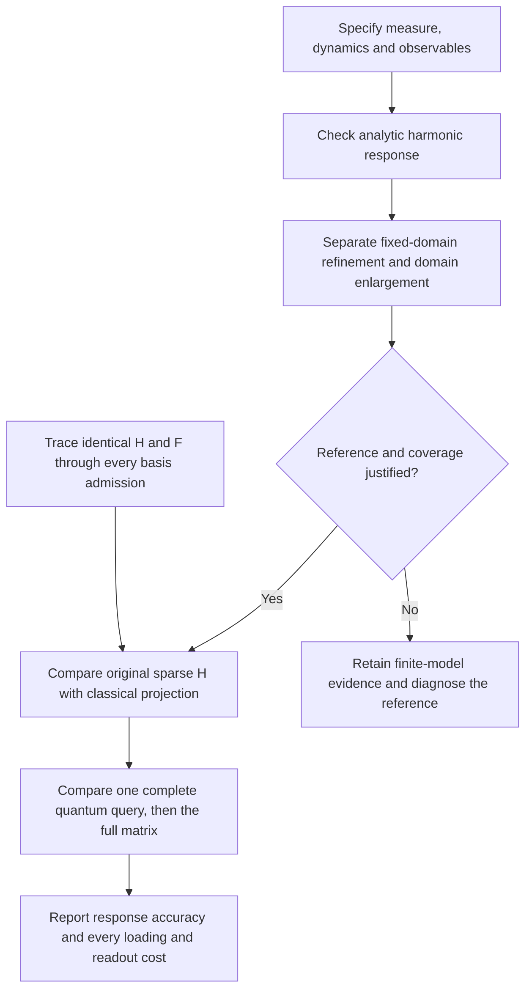

# Proposed recovery of the physical reference and response calculation

**Version 0.4.1 · 13 September 2026 · Proposed work.** These protocols describe future experiments. They do not add a new convergence, portability, protein or quantum result. All v0.4.0 scientific code and numerical evidence remain unchanged.

The existing finite-operator reduction is useful evidence: 17 of 18 cases pass the calculated response-bound gate, and 16 also pass the original host's total-cost gate. All nine grid and nine domain checks fail. Strict Linux bound-array comparison also fails. A small accurate reduced matrix therefore requires a better physical reference and a stable numerical implementation before it can support a protein-scale claim.

| Protocol | Immediate question | Proposed allocation and limit |
|---|---|---|
| [Physical reference](physical-reference-recovery.md) | Does a precisely defined affine-coordinate model have an independently checked reference? | At most ten development problems; two hours, one worker, 4 GB aggregate memory and one million grid states per problem. Preflight or harmonic failure can stop earlier. A native-basin or rotation-quotient interpretation remains open. |
| [Subspace stability](subspace-stability-recovery.md) | Where do identical inputs first produce different admitted subspaces or calculated bounds? | Two existing cases; 30 minutes, one worker and 4 GB. Save every basis admission. Preserve the original strict 10⁻⁹ failure. A local diagnostic is not a Linux portability repair. |
| [Matched quantum comparison](matched-quantum-comparison.md) | Can a complete estimator answer the same accepted H/F queries at useful cost against both classical routes? | Conditional on an accepted model. The precision, wall-time, memory, operation and shot limits must be supplied before launch. No cost advantage is assumed. |

The physical study uses cell-centred grids with fixed reflecting faces, a disclosed change from the historical endpoint grids. It tests static covariance, delayed covariance and their difference separately. Agreement between two boxes cannot establish coverage of an unvisited distant region. The quantum direction walk targets the accepted original sparse operator; the generally dense projected operator is a classical comparator and would need a different encoding if used quantum mechanically.

The related [external biological comparison](../proposed-external-validation.md) remains proposed. KRAS and ABL stay development families. Independent family selection, a primary comparator, statistical precision, missing labels and failure policy must be fixed before evaluation. Neither a new conformer nor a technical replay is an independent biological replicate.

## Preserved evidence and direct checks

- [Original observable-preserving experiment](../../experiments/observable-preserving-reduction/README.md), including all failed scientific gates and the original strict Linux failure.
- [v0.4.0 release CI archive](https://github.com/orbion-life/allosteric-response-benchmark/releases/download/v0.4.0/v0.4.0-release-ci-evidence.zip), including the distinct main and tag replays.
- [Existing-array inspection](subspace-existing-array-inspection.json) and [parent recomputation](parent-existing-array-check.json). These use already saved arrays; they are not new model runs.
- [Known congruent minima](known-congruent-minima.json), extracted from the directly checked prior assessment receipt. Their contribution to the observed convergence failures is unresolved.

The original Linux run and v0.4.0 tag replay each fail 61 of 372 bound-array comparisons; the v0.4.0 main replay fails 62. All 414 response/covariance/time/scale arrays pass in all three. These are separate runs. The unchanged verifier continues to fail; no tolerance was relaxed for this documentation release.

Primary literature is cited alongside each proposed construction. The literature motivates methods and cautions, not a claim that the proposed remedies will succeed. Any implemented recovery will require a new version, executable protocol, full resource record, independent replay and retained failed cases.
