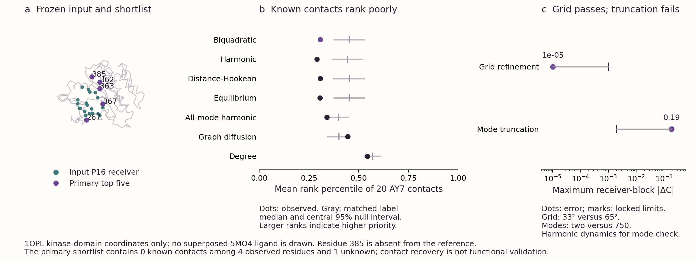

# Project Pulsar: a locked ABL thermal-response pilot

This reproducible second-target experiment is a **negative transfer result**. The fixed two-mode model does not prioritise the known asciminib-contact residues. Its primary top five are **367, 363, 385, 362 and 267** in UniProt P00519 numbering. Four are resolved in the evaluation structure and none contacts AY7 within 5 Å. Residue 385 is unresolved. The contact precision is therefore bounded by **0–1/5**, rather than being established as exactly 0/5.

The numerical grid check passes. The two-mode harmonic approximation fails its comparison with all 750 nonrigid modes. These are separate outcomes: a stable reduced calculation is not evidence that it represents the full protein or predicts biological allostery.



## What was fixed before calculation

[The timestamped preanalysis](preanalysis-protocol.json) and [its SHA-256](preanalysis-protocol.sha256) were written before calculating ABL scores and before extracting the bound-reference labels for this experiment. This is an internal analysis lock, not an externally preregistered or prospective study. The prescribed input and known reference were already known retrospectively.

The input is [1OPL](https://www.rcsb.org/structure/1OPL), author chain A. The retained kinase domain contains 252 resolved residues, P00519 positions 242–493, with author numbers 261–512. The coordinates include the engineered D363N substitution (author D382N). The original structure was determined with P16 and myristate. Removing ligands does not remove that conditioning. The SH3 and SH2 domains are excluded from this bounded calculation (Nagar et al., 2003).

The functional receiver comprises the 19 input-domain residues whose resolved protein heavy atoms lie within 4 Å of input P16: 248, 249, 253, 256, 269, 270, 271, 286, 290, 313, 315, 316, 317, 318, 321, 370, 380, 381 and 382. The prediction universe contains the same 193 nonreceiver residues selected by a minimum Cα distance of 6 Å from that receiver. Exposure is used in null matching, not as a prediction filter.

The graph contains 2,146 contacts at a 10 Å Cα cutoff, with consecutive resolved backbone neighbours retained. The settings are κ = β = μ = 1, with Å coordinates and uncalibrated model energies and time. These engineering settings were inherited without fitting to ABL labels. The two lowest positive Hessian modes are retained. Each coordinate uses the same ±4/√λ₁ domain. The primary grid has 33² states, and the refinement check has 65² states. The horizon is τ = 1/λ₁. Eigenvectors are orthonormal and their largest absolute Cartesian component is positive. The eigenvalue gap at the retained boundary is recorded rather than used to change the selected dimension.

## Model and controls

For reference contact length ℓₑ and instantaneous squared separation rₑ², the edge energy is

$$u_e=(r_e^2-\ell_e^2)^2/(8\ell_e^2),\qquad U=\sum_e u_e.$$

The residue observable Eᵢ is the average of its incident edge energies. **This same fixed quartic observable is used for all physical controls.** The energy controlling the equilibrium distribution and reversible dynamics is either the biquadratic energy, its harmonic approximation, or the distance-Hookean energy ½Σₑ(rₑ−ℓₑ)². This separates the dynamical model from a change of observable.

Reflecting nearest-neighbour grids use the reversible logistic rates already implemented in the first pilot. Sparse matrix exponential action gives the finite-time covariance without trajectories or molecular dynamics. With β = 1,

$$R_{ij}(\tau)=-[\operatorname{Cov}(E_i,E_j)-\operatorname{Cov}(E_i(0),E_j(\tau))],\qquad C_{ij}=R_{ij}/(s_i s_j).$$

Each sᵢ is the exact **all-750-mode harmonic standard deviation of the fixed quartic Eᵢ**. Every physical response and equilibrium comparator uses this common scale. Harmonic covariances are evaluated through contact-displacement Gaussian contractions. On the actual two ABL modes, they are independently checked against polynomial Wick moments. The normalisers are not obtained by enumerating fourth-degree polynomials in 750 variables.

A residue is ranked by the root mean square of C across the receiver residues. Higher values receive higher priority. Canonical positions break ties. Controls include the same-grid harmonic and distance-Hookean dynamics, same-grid biquadratic equilibrium covariance, analytic two-mode and all-mode harmonic dynamics, all-mode equilibrium covariance, graph diffusion, contact degree and inverse receiver distance. The graph diffusion time is the inverse of the first positive graph-Laplacian eigenvalue.

## Retrospective structural evaluation

The bound reference is [5MO4](https://www.rcsb.org/structure/5MO4), author chain A, and **AY7 (asciminib) is the only ligand used to label contacts**. NIL (nilotinib) is excluded. The reference contains T315I and D363N in current canonical numbering; the deposited author labels are T334I and D382N (Wylie et al., 2017). SIFTS label-sequence mapping is used before comparing positions. No rigid overlay or assumed equivalence of the two conformations is needed for the sequence-level contact endpoint.

Every mapped reference residue receives one of three states: `contact`, `observed_noncontact` or `unknown`. A contact means that a resolved heavy atom is within 5 Å of AY7; it is not a functional assay. There are 20 unknown input positions: 277, 278 and 383–400. Eighteen belong to the prediction universe. All 193 candidate ranks remain fixed, but only the **175 reference-observed candidates** enter evaluation and null pools. Twenty of them are contacts. Twelve observed reference residues have incomplete heavy-atom inventories; distances refer to resolved atoms, and the missing atoms are not reconstructed.

An independent direct atom-table/SIFTS check agrees with every label state. Its maximum distance discrepancy is 2.16 × 10⁻⁶ Å, consistent with parser precision. The cross-check records its alternate-conformer limitation. The full labels, variants, partial-residue inventories and distances are in [reference-labels.json](evaluation/reference-labels.json).

| Method | Top five canonical positions | Known hits | Unknown | Mean contact rank percentile |
|---|---|---:|---:|---:|
| biquadratic_d2_n33 | 367, 363, 385, 362, 267 | 0 | 1 | 0.3070 |
| harmonic_d2_n33 | 367, 363, 385, 260, 267 | 0 | 1 | 0.2899 |
| Hookean_d2_n33 | 367, 363, 385, 362, 267 | 0 | 1 | 0.3067 |
| analytic_harmonic_d2 | 367, 363, 385, 260, 267 | 0 | 1 | 0.2894 |
| all_mode_harmonic | 246, 367, 267, 303, 244 | 0 | 0 | 0.3396 |
| biquadratic_d2_n65 | 367, 363, 385, 362, 267 | 0 | 1 | 0.3070 |
| equilibrium_d2_n33 | 367, 363, 385, 362, 267 | 0 | 1 | 0.3054 |
| all_mode_equilibrium | 246, 367, 267, 303, 244 | 0 | 0 | 0.3256 |
| graph_heat_kernel | 263, 264, 262, 265, 308 | 0 | 0 | 0.4440 |
| degree | 351, 407, 418, 420, 419 | 0 | 0 | 0.5439 |
| receiver_inverse_distance | 298, 267, 282, 303, 246 | 0 | 0 | 0.3917 |

For the primary shortlist, the resolved AY7 distances are 13.544 Å (367), 16.559 Å (363), 19.432 Å (362) and 27.080 Å (267). Position 385 has no distance because it is unresolved. The distance-Hookean and equilibrium controls produce the same primary shortlist. None of the executed controls recovers a known contact among its top five. This does not establish that all possible classical methods fail: it describes only these fixed controls on this domain.

The matched-label null conditions on input-only degree and receiver-distance tertiles and the RSA ≥ 0.20 exposure split. Tertiles are computed on the evaluable universe. Ten thousand distinct configurations are sampled with PCG64 seed 20260912 while preserving each stratum's contact count; unknown residues cannot enter any pool. This conditional null does not reproduce the spatial contiguity of a physical pocket. Its p values rely on the stated exchangeability assumption and do not establish experimental biological error rates. The primary mean contact rank percentile is 0.3070, and its one-sided score-enrichment p value is 1.0. Using the original prediction-universe cutpoints while removing unknown members also gives p = 1.0.

[The paired effects](evaluation/evaluation.json) compare primary-minus-control rank percentiles, with ranks fixed over all 193 predictions. The mean improvement over the same-grid harmonic control is 0.01710; over the distance-Hookean control it is 0.000259; and over equilibrium it is 0.001554. The corresponding raw conditional p values are 0.01260, 0.53905 and 0.06009. These are exploratory, unadjusted comparisons, not independent biological randomisations or evidence of useful contact prioritisation. The poor absolute ranking, unchanged shortlist against two controls, and failed truncation check prevent a claim of demonstrated nonlinear or finite-time biological benefit. No global four-target significance claim is made.

## Numerical and physical checks

| Check | Observed value | Locked criterion | Result |
|---|---:|---:|---|
| 33² versus 65² receiver–candidate maximum abs(ΔC) | 1.019 × 10⁻⁵ | ≤ 0.001 and identical top-five sets | Pass |
| Two-mode versus all-mode harmonic receiver–candidate maximum abs(ΔC) | 0.189088 | ≤ 0.002 | Fail |
| Two-mode versus all-mode harmonic full-matrix maximum abs(ΔC) | 0.999998 | Descriptive, not hidden by block selection | Large discrepancy |
| Relative receiver-block harmonic Frobenius error | 0.996391 | Descriptive | Large discrepancy |

The two-mode biquadratic boundary probability is 6.35 × 10⁻⁸ on the primary grid. Its mean maximum contact strain is 0.03440, and the probability that any contact exceeds 20% strain is 5.57 × 10⁻¹¹. These model-distribution diagnostics do not calibrate real protein fluctuations. Every grid and energy variant, including its compression and Cα-overlap diagnostics, is retained in [diagnostics.json](results/diagnostics.json). The 4 Å and 8 Å candidate-mask sensitivities are retained in [evaluation.json](evaluation/evaluation.json); neither changes the primary analysis.

All 252 × 252 response matrices are saved. Symmetry and positive semidefiniteness of −R pass numerical checks. Twelve numeric archives, including both analytic references and all six grid cases, reproduce with bitwise-equal array values in a fresh process and output directory under the recorded environment. This establishes local repeatability, not identical bytes across operating systems or physical validity.

The original calculation took 41.96 seconds and reached 333,643,776 bytes of peak resident memory. The fresh repeat took 43.21 seconds. Both are within the prespecified 900-second and 8-GB bounds. These timings include input parsing, model construction, both harmonic references, six grid cases and graph controls. Structural evaluation, plotting and the fresh repeat are separate costs. No paid computation was used.

## Reproduce locally

The source files are bundled and hashed, so replay does not require a network connection after installing the dependencies. Use Python 3.9 and the pinned versions in `requirements.txt`. The recorded numerical environment used Python 3.9.6, NumPy 2.0.2, SciPy 1.13.1 and BioPython 1.85; see the authoritative [runtime receipt](checks/runtime.json) for the exact interpreter string. Matplotlib 3.9.4 is required only for the figures.

```bash
python3 -m venv .venv
source .venv/bin/activate
python -m pip install -r requirements.txt
python bounded_run.py
python check_input.py
python evaluate.py
python bounded_run.py --output checks/fresh-replay
python -m unittest -v test_verify
python verify.py
python make_figures.py
```

`bounded_run.py` checks wall time and resident memory every 0.5 seconds and stops a calculation if its bound is exceeded. `run.py` verifies the locked input and module hashes and does not open the bound-reference CIF. It saves the prediction freeze before `evaluate.py` reads AY7 labels. A rerun updates generated receipts; preserve the supplied release or work from a fresh copy if the original receipts are required. Archive timestamps and runtime receipts are expected to change. `verify.py` compares array values, matrix invariants, unknown-label exclusion, distinct null configurations and preservation of stratum counts.

The verifier uses an absolute tolerance of 10⁻¹⁰ for normalized responses, scores and equilibrium matrices. Integer, Boolean, rank and index values must match exactly. Only its explicit list of unnormalized moments, covariance responses and standard deviations uses both absolute and relative tolerances of 10⁻¹⁰. Shapes and dtypes must match, and nonfinite values fail. This prevents a large raw polynomial moment from failing solely because of harmless platform rounding while keeping the scientific outputs under strict absolute checks. The unit tests also reject perturbed real response matrices, scores and rankings. This is a verification-policy correction, not a change to the model, inputs, numerical convergence criteria or scientific conclusions; see [the correction record](verifier-portability-correction.json).

New replay checks write [verification-current.json](checks/verification-current.json). The original macOS bitwise-equality receipt remains unchanged at [verification.json](checks/verification.json), with the original verifier and a receipt copy retained in [history](history/verify-v0.3.0.py). A passing local check of the revised verifier does not by itself establish a successful Linux replay.

The exact same preanalysis protocol is retained during replay. Do not edit it to fit a result. A new scientific setting requires a separately dated amendment and retained previous outputs. Two-mode truncation is explicitly a failed approximation under the locked criterion; increasing the grid resolution does not repair it.

## Files and reuse

- [All residue scores](evaluation/all-residue-scores.csv) contain every modelled position, every control score and the reference state.
- [Primary response matrix](results/biquadratic-d2-n33-e4.npz) contains C, R, equilibrium covariance, grid energies, stationary probabilities, sparse generator entries and polynomial observables.
- [Full harmonic reference](results/analytic-harmonic-d750.npz) and [normalisers](model/all-mode-harmonic-scales.npz) retain the common scale.
- [Complete matrix figure](figures/abl-response-matrix.svg) and [summary figure](figures/abl-pilot-summary.svg) are editable SVGs; PDFs and PNGs are included.
- [Current verification](checks/verification-current.json), [original verification](checks/verification.json), [source receipts](source-receipts.json) and the [prediction freeze](prediction-freeze.json) bind code, inputs and results.

The numerical functions in `vendor/prepare.py` and `vendor/run_pilot.py` are unchanged copies of the earlier Project Pulsar pilot. The copied matched-null module is also hash-bound. The ABL orchestration and unknown-aware evaluation are specific to this experiment. The original code is MIT-licensed; primary scientific records retain their own rights and attribution, as described in [DATA-SOURCES.md](DATA-SOURCES.md). No proprietary benchmark, team biography or private machine path is required by the package.

## Interpretation

This experiment is useful because it exposes a limit rather than extending a favourable KRAS result by assumption. The current fixed score does not transfer to ABL contact prioritisation, and the retained two-mode model does not approximate the full harmonic response closely enough. A revised method would need a new locked hypothesis and a test that improves meaningful structural or functional performance against strong controls. The present data do not identify which revised method will work, prove that nonlinear dynamics are irrelevant, or establish quantum advantage.
