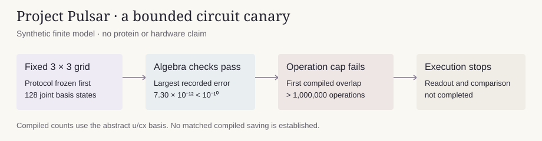

# Project Pulsar: direction-register walk canary

**The engineering gate failed.** The first direction-register overlap exceeded the frozen cap of **1,000,000 total compiled operations** in the abstract u/cx basis. The complete readout was not simulated, the matched two-address circuit was not compiled, and no compiled saving has been demonstrated.

The underlying algebra checks passed within 10⁻¹⁰ on the fixed synthetic 3×3 model. This separates a successful small algebra check from an unsuccessful resource gate. It neither establishes the proposed 21-qubit primary protein construction nor invalidates the walk algebra.



## Recorded outcome

| Check or deliverable | Recorded result |
|---|---|
| Direction shift over all 128 address/direction states | Bijective and involutive; 104 stay, boundary, padding or reserved states remain fixed. |
| Full shift and preparation matrix errors | 5.68 × 10⁻¹³ and 4.96 × 10⁻¹³. |
| Projected walk powers versus Chebyshev polynomials, degrees 0–3 | Maximum absolute error 4.52 × 10⁻¹². |
| Double-control factorization, including absolute phase | Maximum absolute error 3.40 × 10⁻¹². |
| Controlled inverse composition | Maximum absolute error 7.30 × 10⁻¹². |
| First complete direction overlap, all-to-all compilation | More than 1,000,000 total operations; the cap stopped the run. Exact operation count and depth were not persisted. |
| Saved logical overlap | 10 qubits: 1 readout, 2 coefficient, 4 address and 3 direction bits; QPY structurally reloaded. |
| Native QPY, complete overlap statevector, sign-flip execution and line compilation | Not completed. |
| Matched two-address compilation and measured cost comparison | Not completed. |

The cap check occurs before the native circuit and exact counts are saved. Therefore the available compilation result is a **lower bound on the operation count**, not a complete resource receipt. The saved logical circuit is not a native circuit. Its 1.02-second structural reload did not substitute for the missing readout and phase-sensitive execution tests. All small-model algebra values are in [algebra.json](results/algebra.json); the failure is retained in [failure.json](results/failure.json).

The normalized polynomial overlap reference is 0.34657387192501043. The dense exponential reference is 0.34651405696488274. After restoring the retained coefficient sum, the polynomial error is 2.73 × 10⁻⁵, below the omitted coefficient mass of 9.38 × 10⁻⁵. These are classical references. No circuit readout value was obtained.

## Frozen method and execution history

[protocol.json](protocol.json) and [its hash](protocol.sha256) fix the energy, logistic transition rates, grid, padding, signed observables, degree-three polynomial, all five controls, synthesis settings, tolerance and local bounds before execution. This is a synthetic finite-model canary with dimensionless coordinates and energies. It is not a protein prediction or a biological validation.

The direction preparation uses explicitly tabulated transition amplitudes. The shift uses X/MCX gates implementing disjoint edge/reverse-edge transpositions. The full intended estimator includes right-observable preparation, coefficient preparation, selected walk powers, inverse coefficient preparation, inverse left-observable preparation and measured readout. It inserts no whole-walk matrix or matrix exponential into the compiled circuit. Dense operators are used only as classical validation references.

The first attempt was stopped after **972.56 seconds**, while exhaustive composite-operator verification was still running. Its source, log, partial fixture and receipt remain in `attempt-1-unoptimized/`. A [procedural amendment](procedural-amendment.json) changed only the local verification contraction backend: the identical Qiskit contraction indices use `optimize=True`. Eight independent complex parity cases passed with maximum error 1.78 × 10⁻¹⁵ before installation. Runtime warnings were treated as errors and finite values were checked. No installed library file, model, gate, tolerance, instance or synthesis setting was changed.

The continuation took **771.99 seconds** before the operation cap failed. The two attempts consumed **1,744.55 seconds** in total, below the 1,800-second aggregate wall cap. The largest polled resident memory was **1,637,793,792 bytes**, below 4 GB. The subsequent structural reload took 1.02 seconds, making the recorded computation plus reload 1,745.56 seconds. These are local verification and compilation costs, not estimates of device runtime. No paid service or hardware was used.

## Reproduce and inspect

Use Python 3.12 with the exact tested direct dependencies in [requirements.txt](requirements.txt): Qiskit 2.5.2, NumPy 2.5.3 and SciPy 1.18.1.

```bash
python -m pip install -r requirements.txt
python bounded_run.py
```

The current watchdog reproduces the continuation under its remaining **827.44-second** allowance, accounting for the retained first attempt. It also enforces the 4-GB bound. Copy the package before replay to preserve the supplied records. The historical source files are audit snapshots of the original package-root implementation, not a separate runnable package.

`verify_saved.py` is the planned full saved-circuit replay checker. It deliberately requires a successful `results/result.json`, which this failed run did not produce. It must not be described as passed. The stored logical QPY has instead received only the explicitly labeled [structural reload](results/logical-structural-reload.json).

The unchanged two-address reference code is copied from Project Pulsar v0.3.0 into `vendor/current_circuit.py`, with its source hash and release commit in the protocol. [direction-register-audit.md](direction-register-audit.md) derives the reversible map, boundary rule, discriminant identity, controls and resource exclusions. The 21-versus-29 primary count remains an abstract register estimate before arithmetic workspace; the present experiment did not compile that primary model.

## Reuse and limitations

The original Pulsar circuit source is MIT-licensed; its license is retained in `vendor/LICENSE`. The verification contraction follows the Qiskit 2.5.2 index mapping and enables NumPy optimization locally; Qiskit's Apache-2.0 license is retained in `vendor/QISKIT-APACHE-LICENSE.txt`. The synthetic fixture contains no third-party protein coordinates or private benchmark data.

The mathematical construction remains a candidate. This lookup-based implementation has not passed its complete execution or cost gate. A future implementation would need a separately recorded repair, complete controlled readout, a matched resource comparison, and explicit loading/workspace accounting. This record supports no claim of reduced shots, hardware robustness, protein fidelity or quantum advantage.
