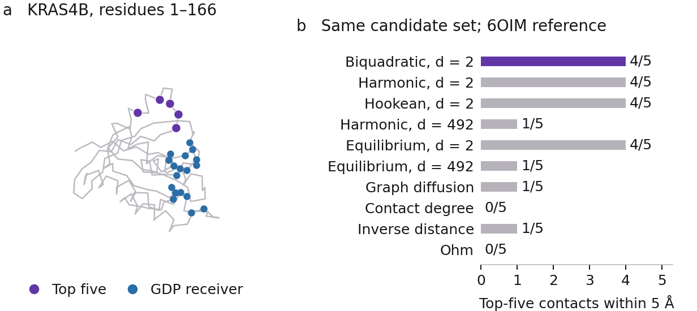
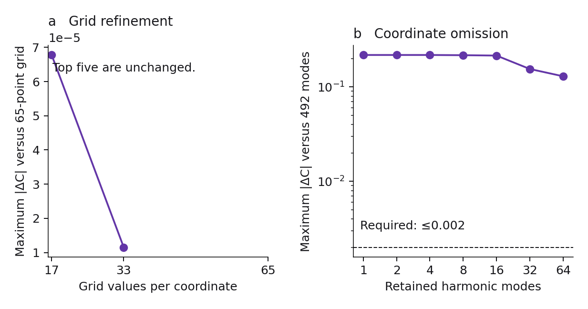

# Project Pulsar: a controlled KRAS structure pilot

This package tests whether the current thermal-response model can produce a traceable protein residue matrix and shortlist. It also tests whether a small retained-coordinate model is an adequate approximation. The second test fails, which limits the interpretation of the first.

The primary two-mode calculation selects residues **60, 69, 62, 61 and 65**. Four have a heavy atom within 5 Å of the reference ligand. The same-grid harmonic and distance-Hookean controls also recover four of five. Equilibrium covariance gives the same primary shortlist. These results do **not** demonstrate a benefit from the biquadratic law, finite-time response, quantum computation or a validated two-mode protein compression.



The [interactive KRAS structure viewer](figures/kras-structure-viewer.html) is a single self-contained HTML file. Download it and open it in a browser to rotate the observed C-alpha trace, inspect any residue and compare the five primary markers with the functional receiver. It works offline without external libraries. It draws no reference ligand or calculated conformation. The two-mode scope and failed compression check remain visible beside the structure.

## What was fixed before scoring

[The preanalysis protocol](preanalysis-protocol.json) was created on 12 September 2026 at 09:45:52 UTC, before response scores or MOV contacts were computed. Its SHA-256 is `0fcae6ed4dc4866f3fb32f63bb29bb38b17dd7552988b776ee4af76d65ca7896`. A [separate evaluation addendum](evaluation-protocol-addendum.json) fixed the matched-random procedure before reference contacts were extracted. These records are retained unchanged. They are an engineering preanalysis record for a known challenge case, not a prospective biological preregistration.

| Setting | Fixed choice and interpretation |
|---|---|
| Input | RCSB 4OBE, chain A; 166 resolved alpha-carbons at KRAS4B positions 1–166. |
| Sequence | UniProt P01116-2, isoform 2B. All 166 modeled amino acids match. |
| Alternate atoms | Highest occupancy, with blank and then A as deterministic tie-breakers. |
| Contacts | C-alpha distance at most 10 Å, plus resolved consecutive backbone neighbors. No artificial link bridges a sequence gap. |
| Functional receiver | The 18 input residues whose heavy atoms are within 4 Å of GDP heavy atoms. GDP, magnesium and water are excluded from the mechanics. |
| Eligible candidates | The 126 nonreceiver residues at least 6 Å in C-alpha distance from every receiver residue. Separate sensitivity uses 4 and 8 Å. |
| Energy parameters | Stiffness κ = 1, inverse thermal energy β = 1 and mobility μ = 1 in uncalibrated model units. |
| Primary basis | The two lowest positive harmonic Hessian modes. Omitted modes are held fixed. |
| Primary grid | 33 values per coordinate within ±4 standard deviations of the slowest harmonic mode; 1,089 states. |
| Response time | One slowest-mode harmonic relaxation time, τ = 13.1504946 model time units. |
| Common normalization | Exact all-492-mode harmonic standard deviations of the same quartic residue observables. |
| Reference endpoint | Sequence-mapped 6OIM chain A MOV contacts within 5 Å, inspected after the prediction files were frozen. |

The 10 Å contact rule and quartic model follow the proposal's declared engineering design. The stiffness is an uncalibrated numerical setting selected before ranking; it is not a measured protein parameter. The 6 Å distal mask is a geometric separation rule, not a universal biological cutoff. The grid tests measure the consequences of these assumptions instead of claiming that the settings are biologically optimal.

The input coordinates were determined with GDP present. Removing ligand atoms does not remove this structural conditioning. The reference has G12C, C51S, C80L and C118S substitutions relative to the input. These differences remain in the provenance and limit a biological comparison. There are 22 mapped MOV-contact residues in the modeled range, of which 17 are eligible candidates. Residues 10, 11, 12, 13 and 16 are excluded by the receiver or distal mask.

The original frozen model labels the accession as P01116. [The identity correction](identity-correction.json) records that its sequence is specifically P01116-2/KRAS4B. It changes no coordinate, receiver, candidate or score. P01116 residue numbering remains valid; the currently displayed canonical sequence is the different KRAS4A isoform.

## The model and the controls

For an input contact vector of length ℓ, the energy is

\[
u_{ij}(r)=\frac{\kappa}{8\ell_{ij}^{2}}
\left(\lVert r_i-r_j\rVert^2-\ell_{ij}^2\right)^2,
\qquad E_i=\frac{1}{d_i}\sum_{j\in\mathcal N_i}u_{ij}.
\]

The perturbation is a sustained field `U + h E_i`. Both the quadratic harmonic energy control and the ordinary distance-Hookean energy control retain these same quartic observables. Comparing models therefore does not silently change the measured quantity.

The finite grid uses reversible nearest-neighbor rates `L_xy = 2 D / [δ²(1 + exp(β(U_y − U_x)))]`, with reflecting boundaries and `D = μ/β`. Its symmetric weighted generator is propagated with SciPy's sparse matrix exponential action. Centered monomial vectors recover every residue-pair covariance, rather than selecting only a convenient residue pair. The output is `R = −β(Cov(E(0), E(0)) − Cov(E(0), E(τ)))`. Dividing by `β s_i^H s_j^H` produces the dimensionless signed matrix `C`. The candidate score is the root mean square of `C` over the fixed functional receiver. Scores are not probabilities of allostery.

The analytic harmonic reference contains all 492 positive modes after six rigid modes are removed. It evaluates the **same quartic observables**, using exact Gaussian contact-displacement contractions. It does not enumerate a quartic polynomial over 492 coordinates. The contraction includes Hermite orders one through four and is checked against independent Gaussian polynomial moments and six-dimensional quadrature. This is an exact harmonic reference, not an all-mode nonlinear calculation.

The comparison includes the same-grid harmonic and distance-Hookean models, all-mode harmonic response, equilibrium covariance, a graph heat kernel, contact degree, inverse receiver distance and an executed upstream Ohm comparator. All use the same 126 candidates for the reported top-five endpoint. Graph and geometric scores retain their native units; only their rankings are compared.

## Results and their limits

| Method | Top five | MOV contacts at 5 Å |
|---|---|---:|
| Biquadratic, two modes | 60, 69, 62, 61, 65 | 4/5 |
| Harmonic, two modes, same grid | 60, 62, 61, 64, 69 | 4/5 |
| Distance-Hookean, two modes, same grid | 60, 62, 69, 61, 65 | 4/5 |
| Harmonic, all 492 modes | 34, 85, 122, 123, 81 | 1/5 |
| Biquadratic equilibrium, two modes | 60, 69, 62, 61, 65 | 4/5 |
| Harmonic equilibrium, all modes | 34, 85, 122, 123, 81 | 1/5 |
| Graph diffusion | 26, 25, 122, 123, 34 | 1/5 |
| Contact degree | 81, 78, 111, 6, 90 | 0/5 |
| Inverse receiver distance | 57, 34, 8, 81, 152 | 1/5 |
| Ohm, pinned upstream implementation | 158, 127, 128, 153, 85 | 0/5 |

The primary five minimum heavy-atom distances are **3.160, 4.280, 3.628, 3.516 and 6.343 Å**. [The full rankings table](evaluation/rankings.csv) contains every eligible residue for every comparator, including its score, contact distance, contact degree and distance from the receiver.

Grid refinement from 33 to 65 values per coordinate changes the largest matrix entry difference by `1.1530 × 10⁻⁵` and preserves the complete primary candidate order. Increasing the domain from ±4 to ±6 slow-mode standard deviations at fixed spacing changes the matrix by approximately `2.1 × 10⁻¹⁶`. These comparisons support the numerical resolution of this particular two-mode calculation.

**Coordinate compression fails the declared gate.** Compared with the all-mode harmonic reference, the two-mode harmonic candidate-to-receiver block has a maximum absolute difference of **0.2183**, versus the declared tolerance of 0.002. Its relative Frobenius error is **0.99937**. Across the entire matrix, including diagonal responses, the maximum difference is 0.999995. The different scopes are reported separately. A grid-converged result is therefore not evidence that two modes preserve the protein response. The two-mode pocket hits cannot be used to choose the dimension after inspecting the reference.



The primary grid assigns probability 0.00730 to configurations in which at least one modeled contact changes length by more than 20%. Its expected maximum contact strain is 0.04754. The retained grid contains no strongly compressed contact under the declared diagnostic and no noncontact C-alpha pair below 2 Å. The boundary probability is `3.41 × 10⁻¹⁴`. These are checks on the retained grid distribution. They neither exclude omitted-mode clashes nor calibrate the model to protein thermodynamics.

The matched-random calculation uses 10,000 candidate sets with the reference set's joint contact-degree and receiver-distance tertile counts. It is a descriptive conditional random-set comparison. It does not match pocket compactness or exposure, does not establish biological exchangeability, and does not provide predictive uncertainty. No experimentally supported nonfunctional-pocket control was supplied; that required biological endpoint remains unexecuted. No claim of cross-target generalization, superiority or quantum advantage follows from this pilot.

The upstream Ohm run uses commit `462a3b1318e24ebe2061137fe88af719ef89c0ae`, with its README-style parameters. The current code remaps CLI alpha 4.5 to internal alpha 0.5, excludes backbone–backbone contacts and applies a path-normalized score. It is not an exact reconstruction of the 2020 paper. Changing its random seed or alpha changes the shortlist; the preserved sensitivity runs make that limitation visible. A single retrospective comparison is not a general benchmark against Ohm.

## Reproduce the calculation

Use Python 3.12 and the pinned packages. The source coordinate files and all metadata are cached, so the primary replay requires no network connection after dependencies are installed. Run this in a copy of the package if you want to preserve the original timestamped receipts.

```bash
python3.12 -m venv .venv
.venv/bin/python -m pip install -r requirements.txt
.venv/bin/python prepare.py
.venv/bin/python -W error run_pilot.py
.venv/bin/python -W error evaluate.py
.venv/bin/python -W error verify.py
.venv/bin/python plot_pilot.py
.venv/bin/python build_viewer.py
```

`run_pilot.py` writes all predictions and their hashes before `evaluate.py` opens the MOV reference. The evaluation refuses a changed or missing prediction freeze. The original runs completed all 24 grid cases and eight analytic dimension controls locally. The recorded primary grid calculation took approximately 0.41 s; the eight analytic references took approximately 43 s together on this host. Timing excludes some preparation, verification and plotting and is not a platform-independent performance claim. Every grid case completed below the declared 120 s engineering limit; a hard timeout is not imposed by the script.

`verify.py` repeats the primary calculation and checks the energy, stationary weights, response, normalized matrix, scores and complete candidate order. The recorded repeat produced identical arrays. It also checks the contact contraction against six deterministic 15,625-point Gaussian quadratures, and checks the tiny grid's response by direct one-sided finite-field perturbations. [The verification receipt](verification.json) preserves errors and code hashes. Six-dimensional quadrature differs from the contraction by at most `1.28 × 10⁻¹³` in the tested fixtures. Successful code checks are not biological validation.

The optional Ohm replay requires a local GCC 15+ compiler with C++23 support, `make`, `patch` and zlib. It uses the cached upstream source archive and the preserved two-line range-adaptor compatibility patch. It does not install software globally.

```bash
.venv/bin/python replay_ohm.py --compiler g++-15
```

The original source, patch, compiler commands, random seeds and outputs are in `external/`. Rebuilding from the cached pristine archive reproduced the contact matrix, primary node scores, bond scores and minimum-distance output bitwise on this host. Cross-platform bitwise equality is not promised.

An additional fresh preparation and full numerical rerun is available with `python repeat_all.py`. The recorded run rebuilt all 24 grids, eight analytic references and structural controls in a separate directory. All arrays in all 33 result archives were bitwise identical; the run took 68.00 s on this host. [The full replay receipt](full-repeat-verification.json) records this result separately from the single-case checks.

The separately instrumented full cached-input run took **67.701 s** with **257.0 MB** peak worker memory. It includes contact/Hessian preparation and all 33 result archives; external Ohm, pocket evaluation, plotting and quantum work are separate. [The complete timing record](cost/full-pilot-cost-public.json) and [portable measurement procedure](cost/pilot-cost-replay.md) define every included phase and exclusion.

## Files and audit trail

| Location | Contents |
|---|---|
| `raw/` | Input/reference PDBs, RCSB metadata, SIFTS mappings, isoform FASTA and source receipts. |
| `model/` | Cartesian model, contact list, sequence/node map, positive modes, exact monomial observables and normalizers. |
| `results/` | All 24 grid matrices and diagnostics, eight analytic harmonic references, and structural baselines. |
| `evaluation/` | All-method rankings, reference mapping, descriptive random controls, mask tests and compression metrics. |
| `figures/` | Editable SVGs, PDF/PNG views, a standalone interactive HTML viewer with input hashes, and complete figure captions. |
| `external/` | Pinned Ohm source archive, GPL license within the archive, compatibility patch, execution record and sensitivity outputs. |
| `prediction-freeze.json` | Hashes of the prediction files before reference-pocket extraction. |
| `identity-correction.json` | Verified KRAS4B isoform clarification without alteration of frozen predictions. |
| `verification.json` | Independent formula checks and repeated primary calculation. |

Two initial execution logs retain a macOS/Apple Accelerate matrix-multiplication warning. The affected operations were replaced with explicit contractions and contact-incidence averaging. The scientific computation subsequently passed with warnings treated as errors. Plotting uses normal warning handling because the installed Matplotlib/pyparsing combination emits a dependency deprecation warning; it does not affect the numeric arrays.

## Sources and reuse

The coordinate sources are [RCSB 4OBE](https://www.rcsb.org/structure/4OBE) and [RCSB 6OIM](https://www.rcsb.org/structure/6OIM). Sequence numbering uses [PDBe/SIFTS](https://www.ebi.ac.uk/pdbe/docs/sifts/) and the [UniProt KRAS4B isoform](https://rest.uniprot.org/uniprotkb/P01116-2.fasta). Ohm's paper is Wang et al. (2020), *Nature Communications*, [doi:10.1038/s41467-020-17618-2](https://doi.org/10.1038/s41467-020-17618-2); its implemented comparator is the separately pinned [upstream repository](https://bitbucket.org/dokhlab/ohm).

The original Project Pulsar code in this package follows the existing project MIT license. The separately archived Ohm source and its patch remain GPL-3.0; they are not relicensed as MIT. Structure and sequence data retain their source terms and attribution. This package forms the KRAS pilot in version 0.2.0 of the Allosteric Response Benchmark.

## Cross-platform comparison policy

`repeat_all.py` compares four model archives and all 33 result archives. It writes a fresh status before execution and all available per-field diagnostics before failure, so an old success receipt cannot be mistaken for a new result. Normalized response matrices and RMS scores require absolute agreement within 10⁻¹⁰; dimensional floating intermediates use 10⁻¹² plus 10⁻¹⁰ times their entry scale. Discrete identities remain exact. A ranking reversal is accepted only when both orders match their own scores and every reversed pair differs by at most 2 × 10⁻¹⁰ in both runs. This tolerance is a numerical comparison rule, not a biological uncertainty bound. Scientific settings and frozen arrays are unchanged.

The first Linux CI attempt exposed the old checker’s universal 10⁻¹² absolute threshold and missing failure diagnostics. Its failure did not by itself establish a scientific discrepancy or a tied ranking. The corrected checker reports every difference and rejects resolved ranking changes. GitHub retains the earlier failed run and uploads generated arrays if a later check fails.
