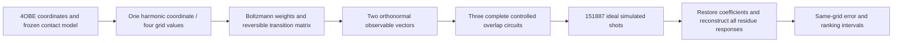

# A complete quantum-walk circuit for a small KRAS-derived response model

This package compiles and simulates the entire overlap estimator used by Project Pulsar. The input comes from KRAS structure **4OBE, chain A**, with 166 resolved Cα coordinates and 1,433 contacts. The engineering fixture retains **one of 492 positive harmonic modes and only four coordinate values**. It verifies an implemented quantum calculation on that fixed, coarse model. It does not establish that this representation preserves protein responses or that a quantum device offers an advantage.

The accepted run uses seven qubits, three independent overlap circuits and 151,887 ideal simulated shots. It reproduces the same-grid classical response with maximum observed normalized response error **1.6434 × 10⁻⁷**. Exact circuit synthesis, observable signs, norm factors, coefficient truncation, routing, sampling and synthetic local noise are included. No hardware was used.



## Reproduce the calculation

The recorded environment uses Python 3.12.14, Qiskit 2.5.2 and Qiskit Aer 0.17.2 on Apple Silicon. From this directory, create an isolated environment and run:

```sh
python3.12 -m venv .venv
.venv/bin/python -m pip install -r requirements-lock.txt
.venv/bin/python run.py --output results-reproduced
.venv/bin/python verify.py
.venv/bin/python compare_runs.py results results-reproduced
```

`run.py` takes frozen, portable inputs from `inputs/`. It verifies every input hash before calculating. It does not download data, call a remote backend or require an account. `verify.py` verifies the shipped `results/` record and reloads and simulates its saved native circuits. It also checks the exact controlled-walk factorization, inactive-control identity, projected Chebyshev powers and sign-sensitive preparation. To reproduce the original less efficient decomposition, use `--walk-implementation naive --output results-naive-reproduced`. To repeat just compilation, ideal execution and finite-shot sampling, add `--skip-noise`.

`results-repeat/` is an independent ideal rerun with the same frozen inputs and seeds. `results/repeatability.json` compares its arrays, counts and native gate resources with the accepted run. Timing and memory are machine-dependent. Probability differences are checked numerically; JSON or QPY byte identity across software versions is not assumed.

The raw PDB and source receipts are included for provenance. The sibling protein pilot package constructs the original contact graph, harmonic coordinates and all-mode harmonic scales. The quantum package starts from their frozen outputs. Its preprocessing timer therefore excludes the original PDB parsing, full Hessian diagonalization and full-mode normalization computation. Reproducing that upstream work requires the sibling pilot package and its documented dependencies. The validation structure 6OIM is not used to tune this circuit or select the two-vector representation.

## What is actually encoded

The coordinate grid is evenly spaced over ±4 harmonic standard deviations of the lowest positive mode. The model uses κ = β = μ = 1 in uncalibrated model units and evaluates at τ = 1/λ₁ = 13.15049461. The four Boltzmann probabilities are approximately `(1.10e-13, 0.48826, 0.51174, 3.92e-13)`. Small boundary probability on this very coarse grid is **not** a domain-convergence test.

For each resolved residue, the local observable is the mean fixed biquadratic contact energy. Its coordinate dependence spans q², q³ and q⁴. The centered q² and q⁴ vectors are affinely dependent on the four symmetric grid values. A weighted singular-value decomposition therefore leaves two basis vectors. This is an algebraic reduction of observable readout on the fixed grid; it removes no additional physical mode and restores none of the 491 omitted modes. The numerical rank cutoff is 1.0037 × 10⁻¹³ and the maximum reconstruction residual is 1.0609 × 10⁻¹⁶.

All primary responses use the **same full-492-mode harmonic standard deviations** supplied by the pilot. Results using the slice's own harmonic scales are retained only as a labeled comparison. A change of normalization must not be mistaken for convergence.

## The full estimator and its scale factors

For grid generator L, equilibrium probabilities π and uniformization rate ν, the code forms

\[
H=-\Pi^{1/2}L\Pi^{-1/2},\quad P=I+L/\nu,\quad M=I-H/\nu.
\]

The row isometry is implemented as a unitary V using explicit, row-controlled amplitude preparation. It prepares `sqrt(P[x,:])` in Y conditional on the X value x. The walk is

\[
W=(2Q-I)V^\dagger\operatorname{SWAP}V,\qquad Q=I_X\otimes|0_Y\rangle\langle0_Y|.
\]

The circuit prepares the signed right basis vector, prepares the coefficient amplitudes, applies selected powers of W, reverses coefficient preparation and reverses left-vector preparation. **All five components are controlled by the readout bit**, between its two Hadamard gates. Measurement of that bit estimates the real all-zero matrix element. There is no initialization/reset operation, postselection or discarded preparation cost. X and Y each use two qubits, the coefficient register uses two, the readout uses one and additional arithmetic workspace is zero.

Within controlled W, V and V† can be applied unconditionally around controlled SWAP. When the controls are inactive, V†V cancels exactly; when active, the intended walk is recovered. The controlled reflection retains its essential global minus sign. This identity reduces synthesis cost without replacing the walk by an arbitrary dense propagator. The original direct-control results and source are preserved in `results-naive/` and `baseline-source/`. Its larger circuit files can be regenerated with the documented naive-control command.

For z = ντ = 0.5625, positive coefficients are `a₀ = exp(-z) I₀(z)` and `aₖ = 2 exp(-z) Iₖ(z)` for k ≥ 1. The accepted truncation is K = 3 and s = Σaₖ = 0.9996804132862802. Coefficient amplitudes are `sqrt(aₖ/s)`. The analytic coefficient-tail bound, evaluated in floating point, is 0.0003198246565203037. It is not a directed-rounded interval certificate. The corresponding all-entry normalized response bound is 6.6532 × 10⁻⁷; the actual same-grid truncation error is 2.9465 × 10⁻⁷.

Let the weighted residue fluctuations satisfy eᵢ = ΣₗDᵢₗuₗ, with orthonormal basis u. A measured basis-overlap matrix χ reconstructs the delayed covariance as `s D χ Dᵀ`. The response is `R = -β(covariance - delayed covariance)` and the reported dimensionless response is `Cᵢⱼ = Rᵢⱼ/(β sᵢᴴ sⱼᴴ)`. Thus all observable norms and coefficient scale factors are restored through D, s and the common harmonic standard deviations. A zero-norm observable is explicitly bypassed. A nonpositive harmonic scale is rejected.

The classical matrix exponential in `model.py` is used only as an exact small-grid reference and to calibrate this fixture's precision. It is never inserted into the quantum circuit. Circuit outputs come from Qiskit Aer execution of the fully synthesized `u`/`cx` circuits, with gate fusion disabled.

## Sampling precision follows reconstruction and the ranking gap

The provisional report budget allocates 0.004 to simultaneous sampling in C units, at family failure probability 0.05. If every measured overlap has error at most ε, define `γᵢ = Σₗ|Dᵢₗ|/sᵢᴴ`. Then

\[
|\delta C_{ij}|\le s\epsilon\gamma_i\gamma_j,\qquad
|\delta S_i|\le s\epsilon\gamma_i
\sqrt{|F|^{-1}\sum_{j\in F}\gamma_j^2}.
\]

For m independent ±1 overlap estimators, `ceil(2 log(2m/0.05)/ε²)` shots per estimator give a sufficient simultaneous Hoeffding bound. These are sufficient bounds, not lower bounds or optimized shot allocations.

The largest exact |C| in this fixture is only 0.0005100. Consequently, even a zero response meets the loose 0.004 cap. We do **not** present the resulting nine-shot bound as useful performance. Instead, the experiment uses the sharper per-score bounds, the exact same-grid fifth/sixth gap of 2.0363 × 10⁻⁸ and truncation bounds to set ε = 0.01375218. All three circuits execute 50,629 shots each. This precision was calibrated using the small classical solution; it is an implementation check, not a procedure claimed to avoid classical work on a large problem.

| Estimator family | Unique overlaps | Sufficient total shots at the same fixed-grid ranking precision |
|---|---:|---:|
| Every residue pair | 13,861 | 1,938,183,630 |
| Three raw monomials | 6 | 347,754 |
| Two orthonormal grid vectors | 3 | 151,887 |

Only the last family's full circuits were compiled and executed. The other shot totals are derived comparisons under the same sufficient-bound policy; their preparation costs were not compiled. Uniform allocation is not necessarily optimal. Sparse or selectively queried residue pairs may also change the direct strategy's cost. No universal quantum speedup follows from this comparison because the same observable reduction is available classically.

## Measured implementation resources

| Scope | Directly controlled original | Factored control, all-to-all | Factored control, bidirectional line |
|---|---:|---:|---:|
| Total qubits | 7 | 7 | 7 |
| CX per complete overlap | 40,404 | 2,304 | 4,443 |
| One-qubit u gates per overlap | 42,038–42,041 | 2,465–2,468 | 2,472–2,475 |
| Depth, including final measurement | 74,711–74,713 | 3,984–3,986 | 6,151–6,153 |
| CX × all 151,887 shots | 6,136,842,348 | 349,947,648 | 674,833,941 |

These are exact synthesis counts for the pinned compiler settings, not lower bounds. `u`/`cx` is an abstract universal gate basis. The line is a routing constraint, not a calibrated device. Per-component counts in the JSON show preparation, coefficient loading, SELECT and unpreparation separately; isolated counts need not sum to the optimized whole-circuit count.

The accepted run took 16.074 seconds including compilation, ideal simulations, finite-shot simulations and nine synthetic noise/readout cases. Peak process resident memory was 198,148,096 bytes. Three all-to-all compilations took about 0.059 seconds in total, their exact ideal simulations about 0.098 seconds and their finite-shot simulations about 0.174 seconds. These are local CPU measurements. Aer can sample many shots from one evolved state, so the native-gate-count × shot totals are **derived device-workload projections**, not a claim that the simulator executed those hundreds of millions of gates independently.

The exact same-grid classical propagator and complete residue reconstruction took a median 0.171 milliseconds over 30 local executions. This tiny case gives no quantum computational advantage. Neither device pulse durations nor physical T₁/T₂, queue time, large-model state preparation or actual hardware runtime was measured.

## Ideal accuracy and synthetic noise

The largest reconstructed C difference between exact compiled-circuit expectations and the polynomial reference is 2.02 × 10⁻¹⁷. The ideal sampled calculation differs from the exact same-grid response by at most 1.6434 × 10⁻⁷. Its five highest eligible residue scores have a smallest lower interval of 9.4142 × 10⁻⁸; all other eligible residues have an upper interval at most 8.4084 × 10⁻⁸. These simultaneous sampling-plus-truncation intervals concern **only this fixed model**. They do not include coordinate reduction, grid/domain error, model error or biological validation.

The noise model applies the channel `(1-p)ρ + p(I_A/2ᵏ)⊗Tr_Aρ` after every synthesized one- or two-qubit gate. Exact density-matrix simulation uses p = 10⁻⁴, 10⁻³ and 10⁻². Independent final readout flips of 0, 0.01 and 0.03 are applied analytically to each Z expectation as `(1-2r)χ`; this is an exact classical readout transformation, not an additional circuit execution. The implementation follows the [Qiskit Aer depolarizing-channel definition](https://qiskit.github.io/qiskit-aer/stubs/qiskit_aer.noise.depolarizing_error.html).

| Per-gate p | Maximum device bias in C, over tested readout rates | Within provisional 0.001 device cap? | Worst-case noisy ranking intervals separate? |
|---:|---:|---|---|
| 0.0001 | 0.0005835 | Yes | No |
| 0.001 | 0.0015442 | No | No |
| 0.01 | 0.0015706 | No | No |

The observed top-five set remains unchanged in these synthetic mean responses, but this is insufficient to claim robust noisy ranking. A conservative channel-mixture bound allows overlap bias at most `2[1-(1-p)^g]` for g gate applications. Propagating this bound, readout bias, sampling and truncation through D does not separate the ranking intervals in any tested noisy case. Failure of this sufficient bound does not prove a ranking error; it means this experiment does not certify one is absent. The device cap itself is loose relative to this fixture's response scale.

## Evidence files and limits

- `results/quantum-results.json` contains measured and derived results, all protocol settings, software versions, source hashes, resource counts and noise results.
- `results/circuits/` contains the logical QPY circuits and synthesized all-to-all/line QPY and OpenQASM 3 circuits.
- `results/fixture.npz` contains the grid, P/H/M, weighted observables, signed basis, reconstruction, norms, coefficients and reference response matrices.
- `results/ideal-response-matrices.npz` and `results/noise-*.npz` contain all reconstructed response and score arrays.
- `results/verification.json` and `results/repeatability.json` report independent verification and repeat execution.
- `results-naive/` and `baseline-source/` preserve results and source for the original more expensive implementation and its failure under the same synthetic noise family. The large naive circuit files are regenerated on request, rather than duplicated in this package.
- `inputs/input-manifest.json` binds every portable input to its hash and upstream origin. `requirements-lock.txt` records the exact installed dependency versions.

No part of this fixture validates the omitted protein modes, the four-point grid, model energy/time units, transfer to another target, or biological allosteric predictions. Those questions belong to the separate physical pilot and future validation. This package supplies a reproducible complete-circuit implementation, a finite-precision cost record and explicit evidence of the remaining noise and scale limits.

## License and source data

Project code and documentation use the MIT license in `LICENSE`. PDB archive coordinates are available under CC0 1.0, as described in the [RCSB PDB usage policy](https://www.rcsb.org/pages/usage-policy). Source receipts retain the structure download URL, date and SHA-256. Dependency licenses remain with their respective projects; this package distributes pinned dependency names, not a bundled environment.

The verifier also accepts `python verify.py --results results-reproduced` to inspect a newly generated result directory. Continuous integration verifies the newly compiled circuits, rather than only the archived results.
