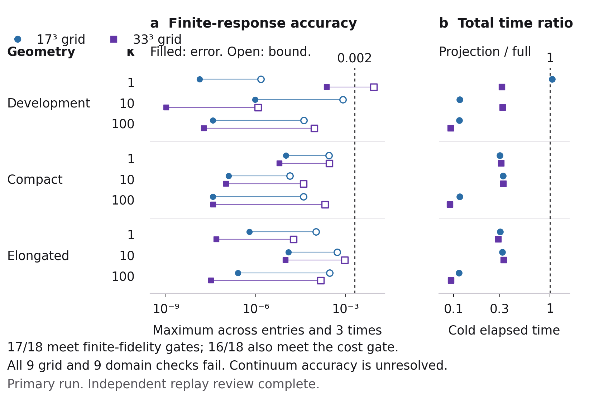

# Project Pulsar: preservation of a finite response operator

This experiment asks whether an observable-informed projection can reproduce the contact-energy response of a **fixed, fully resolved finite numerical model** at lower total classical cost. It retains all three internal coordinates of three-node networks and all original nonlinear node-energy observables. It does not test a protein, a quantum circuit or a converged continuum model.

The primary run completed 18 finite instances: three geometries, three stiffness values and two grids. Each instance contains three response times. Seventeen instances passed the finite-fidelity gates; sixteen also passed the recorded dimension and total-cost gates. **Every geometry–stiffness pair failed both the grid and domain response checks.** The experiment therefore supports a bounded numerical result, not general physical fidelity or a passing representation across the complete tested range.

**Verification status:** independent full replay review and parent verification are complete. The replay agrees across all 27 archives and 1,065 arrays, with maximum absolute difference 1.17×10⁻¹⁵. All selected ranks and scientific gate decisions agree; the combined practical count remains 16/18. The [independent review](audit/results-independent-review.md) and [parent verification](audit/parent-direct-verification.json) preserve the evidence and its scope. This package preserves the completed study; a release tag is pending until repository-level verification finishes.



## What was fixed before the new calculations

The authoritative specification is [`preanalysis.json`](preanalysis.json). The protocol, source receipts and pre-execution changes are preserved. The first geometry had already been studied in the earlier harmonic-completion experiment. The other two geometries had not previously received nonlinear reference calculations in this project. This is a development/held-out-geometry distinction within a synthetic study; the instances are not independent biological replicates.

| Geometry | Native coordinates in Å |
|---|---|
| Development | (0, 0, 0), (4, 0, 0), (1, 3.5, 0) |
| Compact | (0, 0, 0), (3, 0, 0), (1.2, 2.4, 0) |
| Elongated | (0, 0, 0), (5, 0, 0), (0.8, 1.5, 0) |

All three pairs of nodes are connected. Each geometry uses κ = 1, 10 and 100, with β = μ = 1. The three positive native Hessian modes define the complete internal coordinate chart used here. No internal mode is removed before constructing the finite operator. These model scales are not physiological calibration.

The primary grids contain 17³ = 4,913 and 33³ = 35,937 configurations. Every coordinate spans ±4/√λ₁, where λ₁ is the lowest positive native harmonic eigenvalue. The domain diagnostic uses 41³ = 68,921 configurations over ±5/√λ₁, preserving the 33-point grid spacing. Responses are evaluated at t/τ = 0.1, 1 and 10, where τ = 1/λ₁ in the fixed units. These local coordinate boxes do not establish a global quotient over rigidly equivalent configurations or complete thermal-basin coverage.

## From contact energy to the measured response

For an edge e with native length ℓₑ and displaced separation rₑ(q), the energy is

$$
U_e(q)=\frac{\kappa}{8\ell_e^2}
\left(\lVert r_e(q)\rVert^2-\ell_e^2\right)^2.
$$

The total energy is the sum over edges. Eᵢ is the sum of incident edge energies divided by node i's contact degree. On the reflecting finite grid, πₓ is proportional to exp(−Uₓ). The harmonic standard deviation sᵢᴴ is computed for the **same quartic observable** using all three native harmonic modes. The normalized observable vector is

$$
f_i(x)=\sqrt{\pi_x}\,
\frac{E_i(x)-\langle E_i\rangle_\pi}{s_i^{\mathrm H}}.
$$

Let F contain these three vectors. Neighbouring grid configurations x and y have rates

$$
q_{xy}=\frac{2}{\Delta^2}\,
\operatorname{logistic}\!\left[-(U_y-U_x)\right].
$$

The symmetric relaxation operator has off-diagonal entries −√(qₓᵧqᵧₓ) and diagonal entries ∑ᵧqₓᵧ. Its equilibrium vector is √π. The normalized response matrix is

$$
C(t)=F^{\mathsf T}e^{-tH}F-F^{\mathsf T}F.
$$

The first term is delayed covariance and the second is equal-time covariance, both divided by the fixed harmonic standard deviations. The inverse-temperature factor in linear response cancels in this normalization. Negative C means a reduction in the corresponding mean contact energy under the model intervention; it does not establish biochemical inhibition.

## The projection preserves observables before approximating dynamics

The basis begins with the column space of F and expands by applying H to the current frontier. The implementation uses two reorthogonalization passes and an SVD of the residual block. It applies the same construction independently to each geometry, stiffness and grid. It never reads a saved full response when building or selecting that basis.

For an orthonormal basis V, define Hᵣ = VᵀHV and B = VᵀF. The reduced calculation is

$$
\widetilde C(t)=B^{\mathsf T}e^{-tH_r}B-B^{\mathsf T}B.
$$

If V contains F exactly, the equal-time covariance is retained exactly in exact arithmetic. The remaining approximation concerns delayed propagation. The code records seed-projection error, Gram-matrix error and orthogonality error instead of treating floating-point containment as exact.

The allowed ranks are 3, 6, 12, 24, 48 and 96. A relative dependency threshold of 10⁻¹² controls residual-block admission. At a checkpoint boundary, the implementation retains only the leading residual-block vectors that fit and discards the remainder. It therefore implements a bounded, truncated block-Krylov expansion; it does not claim complete block moment matching. The first checkpoint whose calculated bound passes all observables and all three times is selected. Only **after** this selection does `expm_multiply` calculate the full reference on the same H. If no checkpoint passes, the final attempted rank is retained as a failure.

## The calculated bound is checked against a separate full calculation

For the ideal orthonormal case, write the operator residual as R = HV − VHᵣ. The Duhamel identity gives

$$
e^{-tH}V-Ve^{-tH_r}
=-\int_0^t e^{-(t-s)H}R e^{-sH_r}\,ds.
$$

Both symmetric positive-semidefinite operators generate contractions. With exact observable containment, this gives the sufficient delayed-entry bound t‖fᵢ‖‖R‖₂‖fⱼ‖. The implementation also evaluates tighter integrated bounds. If cᵢ = Vᵀfᵢ and rᵢ(s) = R exp(−sHᵣ)cᵢ, the one-sided bound uses ∫₀ᵗ‖rᵢ(s)‖²ds. Under exact Galerkin orthogonality, the two-sided bound uses

$$
J_i(t)=\int_0^t(t-s)\lVert r_i(s)\rVert^2\,ds,
\qquad |\text{delayed-entry error}|\le\sqrt{J_i(t)J_j(t)}.
$$

The source accounts separately for missing seed components, the static Gram discrepancy, VᵀV − I, nonzero VᵀR and finite-arithmetic allowances. Tiny negative projected eigenvalues are clipped only within the stated tolerance; the residual is computed using the operator actually propagated after clipping. The integral kernels use stable small-argument series and are tested against quadrature.

These are analytic finite-model inequalities **evaluated in floating point**, with a 10⁻⁹ allowance when checking measured error against the calculated bound. They are not directed-rounding or interval-arithmetic certificates. The full reference uses a different numerical propagation route on the same finite operator; it is not an independent physical model or a continuum reference.

## Gates and primary results

| Gate | Recorded requirement |
|---|---:|
| Maximum normalized static-covariance error | ≤10⁻¹⁰ |
| Maximum normalized delayed-covariance and response errors | Each ≤0.002 |
| Maximum calculated response-error bound | ≤0.002 |
| Maximum entrywise basis-orthogonality error | ≤10⁻¹⁰ |
| Operator dimension reduction | At least 4-fold |
| Total cold projection/reference time ratio | ≤1 |
| Grid and domain response differences | Each ≤0.001 |

All maxima cover the relevant matrix entries and all three times. These are predeclared engineering thresholds, not biological accuracy or competition thresholds. See [`figures/instance-data.csv`](figures/instance-data.csv) for all 18 rows and [`figures/convergence-data.csv`](figures/convergence-data.csv) for all nine diagnostic pairs.

| Primary observation | Measured result |
|---|---:|
| Observed response error below 0.002 | 18/18 |
| Combined finite-fidelity gates passed | 17/18 |
| Cold time ratio alone ≤1 | 17/18 |
| Finite fidelity, dimension and cost gates all passed | 16/18 |
| Selected or final attempted ranks | 24, 48 or 96 |
| Configuration-space dimension reduction | 51.18-fold to 748.69-fold |
| Maximum response-error range | 1.02×10⁻⁹ to 2.35×10⁻⁴ |
| Maximum calculated-bound range | 1.17×10⁻⁶ to 8.67×10⁻³ |
| Total cold time-ratio range | 0.0915 to 1.0515 |

The fourfold dimension gate is easy to satisfy under the imposed rank cap and large finite-state grids; it is not separate evidence of useful cost. Two distinct instances explain the failed combined gates. The development geometry at κ = 1 on the 33³ grid reaches rank 96 with measured error 0.000234970 but calculated bound 0.00867205. It fails bound-based admission despite its small measured error. On the 17³ grid, the same geometry and stiffness pass fidelity but have a cost ratio of 1.051506. Their results remain visible and were not used to retune thresholds or add ranks.

Across the nine geometry–stiffness pairs, grid differences range from 0.00309 to 0.04663 and domain differences from 0.00262 to 0.05694. All exceed 0.001. Thus agreement with a fixed finite operator cannot be interpreted as convergence to the unbounded nonlinear model. Nor does it rescue earlier failed protein-coordinate reductions.

## Total cost includes construction and unsuccessful checkpoints

For each finite instance, both methods are charged the same measured setup time for geometry, harmonic scales, equilibrium quadrature, observables and sparse H. The projection cost then includes basis construction, all attempted checkpoints, bound evaluation, projected exponentials and reconstruction for all three times. The reference cost includes the three full sparse exponential actions and reconstruction. These are non-amortized, cold algorithmic costs; they exclude interpreter startup, file serialization and study-level diagnostic runs. Both alternatives use classical CPU numerical routines.

The primary study's recorded run took 178.36 seconds, including saved-output overhead; the external monitor recorded 179.10 seconds including its execution overhead. The process peak was 799,440,896 bytes, and the monitor's sampled aggregate peak was 799,391,744 bytes. These differ because the monitor samples at 0.25-second intervals. Neither timing ratio is a repeated-performance confidence interval. Machine load and numerical-library differences may change elapsed times and therefore cost-gate outcomes.

The frozen resource ceilings are 1,800 elapsed seconds and 4,000,000,000 aggregate bytes, with one worker and one BLAS thread. `bounded_run.py` monitors the child process group and terminates it when a sampled ceiling is exceeded or monitoring fails. The numerical script also checks elapsed time and process peak memory. Sampling cannot exclude a transient between checks. The wrapper's own memory is outside the monitored worker process group; native peak-RSS fields are cumulative process-lifetime peaks. Run through the monitored entry point and set the thread limits below; calling the numerical script directly omits the external aggregate-memory watchdog.

## Reproduce the experiment without overwriting the evidence

Use a Python environment compatible with the pinned NumPy and SciPy versions in [`requirements.txt`](requirements.txt). The numerical implementation uses no stochastic biological simulation or sampling of labels. The independent algebra tests use seed 20260912. Example commands, run from this directory:

```bash
python3.12 -m venv .venv
.venv/bin/python -m pip install -r requirements.txt
PYTHONWARNINGS=error OMP_NUM_THREADS=1 OPENBLAS_NUM_THREADS=1 MKL_NUM_THREADS=1 VECLIB_MAXIMUM_THREADS=1 NUMEXPR_NUM_THREADS=1 .venv/bin/python -W error -m unittest test_operator.py -v
PYTHONWARNINGS=error OMP_NUM_THREADS=1 OPENBLAS_NUM_THREADS=1 MKL_NUM_THREADS=1 VECLIB_MAXIMUM_THREADS=1 NUMEXPR_NUM_THREADS=1 .venv/bin/python -W error bounded_run.py replay-local
```

The output directory must not already exist. This intentionally prevents a replay from overwriting primary results. A stopped run records its failure in `run.json` and its watchdog status. Preserve that directory. Do not silently increase the budget, relax a threshold or resume into it after inspecting outcomes. Any later protocol change requires a new declared experiment.

The seven unit tests cover parity with the inherited full-grid implementation and a dense exponential, residual bounds, nonorthogonal-basis corrections, integral kernels, an invariant observable subspace, rejection of a non-positive-semidefinite projected operator, and accounting for a missing seed component. [`pre-execution-review.json`](pre-execution-review.json) records the pre-run review and corrections. These tests are narrower than the completed full replay comparison. The replay used Python 3.12.14, NumPy 2.1.3 and SciPy 1.14.1; its launch and environment are recorded in the independent review.

The comparator tests include a complete CLI rejection of a planted response change, with a diagnostic receipt required before the nonzero exit. Run all tests with `python -W error -m unittest -v test_operator.py test_verify.py`. The intentionally failed diagnostic in `checks/planted-response-drift-receipt.json` is a verifier negative control, not a scientific-run result.

Run the portable semantic checker on the new replay:

```bash
.venv/bin/python -W error verify.py --replay replay-local --output checks/replay-local-verification.json
```

The checker verifies frozen source/protocol/evidence hashes, all 27 case identities, complete field sets, first-passing-checkpoint decisions, cost arithmetic and every scientific outcome. It compares **786 physical arrays**—responses, static and delayed covariances, bounds, times and harmonic scales—at the existing absolute **1e-9** allowance. The **279 reduced-coordinate arrays** (`Hr`, `coefficients`, `residual_Gram`) can change under an equivalent basis rotation. Their raw entries are therefore not compared across platforms; their dimensions, finite values, symmetry/positivity and reconstruction of the stored physical response are checked. This semantic policy was declared during packaging before the new Linux run. The archived original-host audit separately compared all 1,065 arrays.

A `PASS` means reproducible software and evidence under this policy. It does **not** require a scientific fidelity, grid, domain or cost pass. Failed scientific cases remain explicit. Selected ranks and fidelity/diagnostic decisions must agree; hardware-dependent timings and cost-gate outcomes are recomputed and reported separately, not forced to match. A complete receipt is written before failure is raised. See [`audit/LOCAL-AUDIT-CONTEXT.md`](audit/LOCAL-AUDIT-CONTEXT.md) for the archived project-relative helper and [`docs/operator-mathematical-audit.md`](docs/operator-mathematical-audit.md) for the full mathematical derivation.

The repository workflow installs Python 3.12 and the pinned requirements, runs the seven original operator tests plus seven comparator tests with warnings treated as errors, and executes a fresh bounded campaign in a unique temporary directory. It retains generated arrays, diagnostics and failure logs as workflow artifacts. This automation has been prepared; a completed Linux-run receipt is required before claiming cross-platform replay success.

## Regenerate the figures

The plotting script reads the recorded arrays; it does not recompute or fit any response. It independently recalculates each plotted maximum and every grid/domain difference. Install Matplotlib 3.9.4 in a plotting environment, then run:

```bash
python figures/plot_response_operator.py --replay-status 'review complete'
```

This writes a 174×118 mm standalone figure and a 174×58 mm report figure, `operator-preservation.pdf`, with corresponding PNG and SVG files. All labels are 10.4 points at their saved width. Filled symbols show maximum measured error; open symbols show the maximum calculated bound. Blue circles identify 17³ grids and violet squares identify 33³ grids. The cold-cost panel plots projection time divided by full-reference time from the primary run. The narrow failed cost ratio is 1.051506 in the primary run and 1.009180 in the independent replay; two same-host runs do not establish a stable timing margin. Horizontal error-to-bound connectors do not represent confidence intervals. The separate maxima need not occur at the same matrix entry or time.

The report-size figure requires its caption to state the finite scope, three-time aggregation, primary-run timing, failed grid/domain checks and independent-review status. `--replay-status 'review complete'` changes only the standalone status label and must be used only after the parent has verified the independent receipt. It does not itself perform a replay. [`figures/figure-provenance.json`](figures/figure-provenance.json) records the input hashes, plotting versions and derived counts.

## Files, provenance and scientific boundary

- [`operator_study.py`](operator_study.py) implements the current operator study. [`bounded_run.py`](bounded_run.py) is its monitored entry point.
- [`reference_source.py`](reference_source.py) and `vendor/` retain inherited physical-model helpers. They are imported for model construction and parity tests; their historical command-line entry points are not the entry point for this study.
- [`source-receipts.json`](source-receipts.json) pins the scientific sources. `preanalysis.sha256` pins the final pre-execution protocol. `history/` preserves earlier protocol/source states rather than replacing their history.
- `results/` contains the primary run, every checkpoint, full-reference arrays, three-time results and resource receipts. `replay-independent/` and `audit/` belong to the separate replay review; their presence alone does not certify it.
- [`LICENSE`](LICENSE) governs this source package. The repository release tag is assigned only after the clean-environment checks complete.

The final pre-execution protocol SHA-256 is `530fede82261aec39165f06d0126e75e995ad131c0af0db170ce6f9c6880ada3`. The scientific script SHA-256 is `13d80e28d8acaf9ca435938d8ef08668b3cf9d0e750b7b0970b6cf26f19434ef`. The primary `results/run.json` SHA-256 is `fe58d798b53a461ad4cd5eedf60b600f3478dd36de7aa4ac1d2cec2b1e6da17e`.

The projected operator remains symmetric positive-semidefinite, but its entries need not retain the original grid's Markov signs or neighbour structure. This experiment supplies no compatible quantum encoding, compiled circuit, quantum cost advantage, biological validation or protein-scale full-operator construction. Its inference is narrower: an observable-informed classical projection can preserve selected finite-model responses, with explicitly measured exceptions and unresolved physical convergence.
