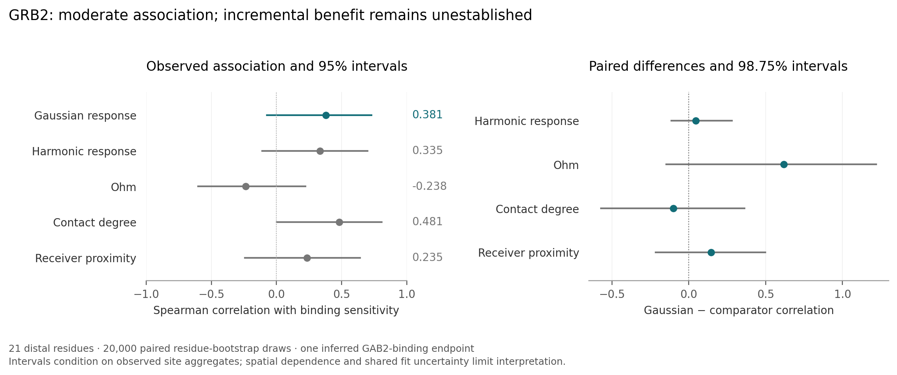

# GRB2 functional evaluation: association without demonstrated incremental benefit

The prespecified GRB2 evaluation completed on 21 distal residues. Gaussian response had a Spearman correlation of 0.381 with inferred GAB2-binding sensitivity, compared with 0.335 for harmonic response and 0.481 for contact degree. Gaussian and harmonic response selected the same five residues. The prespecified gate for incremental benefit over all four controls failed. This is a usable retrospective functional benchmark and an unfavorable result for the current superiority claim.

| Method | Spearman correlation | Gaussian minus method | Paired 95% interval for difference |
|---|---:|---:|---:|
| Gaussian response | 0.381 | — | — |
| Harmonic response | 0.335 | 0.045 | −0.069 to 0.209 |
| Ohm, mean of three seeds | −0.238 | 0.618 | 0.037 to 1.095 |
| Contact degree | 0.481 | −0.100 | −0.457 to 0.245 |
| Negative receiver distance | 0.235 | 0.145 | −0.133 to 0.416 |

All four multiplicity-adjusted, 98.75% difference intervals include zero. The nominal Ohm interval must therefore not be singled out as proof of superiority. Gaussian's own 95% site-bootstrap interval is −0.074 to 0.730. These intervals resample residues, condition on observed site aggregates, and do not fully account for spatial dependence or shared experimental-model uncertainty.

## Endpoint and input

[PROTOCOL.md](PROTOCOL.md) was hash-frozen at 09:25:58 UTC on 14 September 2026, before the new predictions were joined to outcomes. Earlier qualification had inspected the assay schema and values; this is a prespecified retrospective extension, not a lifetime-blind holdout. No structure, receiver, time, cutoff or comparator was selected by its outcome in this evaluation.

The input is the isolated, unliganded GRB2 C-terminal SH3 structure [1GFC](https://www.rcsb.org/structure/1GFC), cropped to the exact 56-residue assay sequence, canonical residues 159–214. The fixed 15-residue GAB2 receiver is transferred by sequence from heavy-atom contacts within 5 Å in [2VWF](https://www.rcsb.org/structure/2VWF). The reference has P212A; the apo input retains the assay's proline. Deposited NMR geometry has quality limitations, recorded in `inputs/wwpdb-validation.json`. No relaxation or repair was performed.

Receiver residues and other residues less than 6 Å away by Cα distance were excluded. The primary endpoint is the equal-weight mean absolute binding ΔΔG among common, valid single substitutions with finite binding and folding estimates and positive finite reported uncertainties. Folding sensitivity uses the same substitutions. Of 1,056 GRB2 single substitutions, 756 qualify; 300 lack joint usable estimates or uncertainties. All 21 distal residues have at least ten qualifying substitutions. The other 35 residues comprise 15 receiver residues and 20 nearby residues.

The binding and folding energies are inferred by [Faure et al. (Nature, 2022)](https://www.nature.com/articles/s41586-022-04586-4), Supplementary Table 7. The reported uncertainties describe model-fit spread, not independent affinity replicates. There is no justified neutral-residue equivalence margin and no experimentally supported nonfunctional-pocket label in this analysis.

## Model, controls and sensitivity

Gaussian and harmonic response use the same complete 162-coordinate contact model, degree-averaged quartic energy observables, full-mode harmonic normalization, receiver and fixed time τ. Gaussian dynamics are a fitted Gaussian/Ornstein–Uhlenbeck surrogate. Executing this model does not establish fidelity to original nonlinear dynamics. Ohm uses the pinned upstream implementation, 10,000 rounds each for seeds 11, 29 and 47, averaged before the outcome join. The seed-11 repeat is bitwise identical.

All 20 deposited [1GFD](https://www.rcsb.org/structure/1GFD) models were evaluated by the same Gaussian/harmonic algorithm on the primary endpoint mask. Gaussian correlations range from 0.340 to 0.439; score-rank correlations with the primary structure range from 0.944 to 0.988. These are structure-sensitivity ranges, not confidence intervals or a basis for selecting the best model. The primary Gaussian/harmonic top five are 178, 211, 202, 183 and 197. Folding-adjusted Gaussian correlation is 0.178; adjustment for folding, degree and distance gives 0.262. Neither establishes biological superiority.

Primary scoring, including all controls, took 2.67 s on one local CPU thread. Primary plus 20 structure-sensitivity predictions took 31.68 s, with 257.3 MB peak resident memory; evaluation took another 0.48 s. These exclude environment setup, comparator compilation and verification. No GPU, molecular dynamics or quantum hardware was used.

## Verification and replay

[REPRODUCE.md](REPRODUCE.md) distinguishes a compact saved-result audit, a fresh model replay and an optional raw-workbook audit. Independent checks restore the receiver and coordinates; recompute reported statistics, 500 bootstrap samples and intervals; compare Wick polynomial contractions and variational derivatives; and reconstruct site aggregates directly from the workbook with decimal accumulation. Receipts are in `qa/`. A copied packet passed the saved-result audit without private inputs, then rebuilt Ohm from the included source and reproduced all 21 Gaussian response arrays, primary scores and reported correlations exactly on the same host. The publisher workbook was supplied separately for that fresh evaluation; it remains excluded from the packet. The complete numerical records are in `results/summary.json` and the raw model arrays.

This packet contains own code, raw model predictions, derived site aggregates and licensed upstream source. It excludes the publisher workbook, copied mutation-level assay rows and platform-specific executables. Source hashes, download locations and rights distinctions appear in [SOURCES-AND-RIGHTS.md](SOURCES-AND-RIGHTS.md). A successful replay validates the computation; it does not create new experimental evidence, establish independent-family generalization or resolve the challenge's negative-pocket endpoint.
